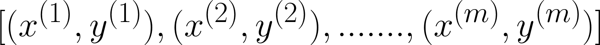
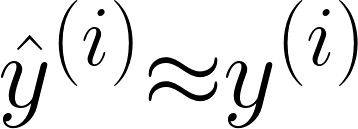
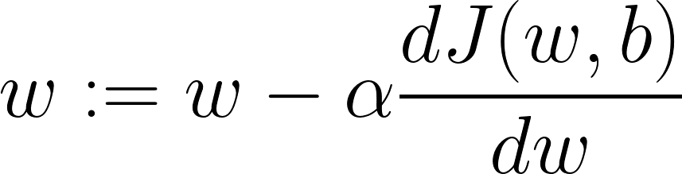

# 🔎 Esas Problem
Aşağıda verilen veri seti için:  

Bizim amacımız:

## 📚 Temel Kavramlar ve Notasyonlar

| Kavram          | Açıklama      |
| --------------- |---------------|
| `m`             | Veri setindeki örnek sayısı   |
| x(i) | Veri setindeki `i`'inci örnek  |
| `ŷ`             | Tahmin edilen (predicted) çıktı |
| Kayıp Fonksiyonu _Loss Function_ `𝓛(ŷ, y)` | **Tek** bir örnek için hata hesaplama fonksiyonu |
| Cost Gunction `𝙹(w, b)` | Tüm eğitim setinin kayıp fonksiyonlarının ortalaması  |
| Convex Function | Tek bir yerel değere sahip bir fonksiyon |
| Non-Convex Function | Çok sayıda farklı yerel değere sahip bir fonksiyon |
| Gradient Descent | Cost Function'ın global değerini bulmak için kullanılan iteratif bir optimizasyon yöntemidir |

> Başka bir deyişle: `Cost Function`  `w` ve `b` veri seti için ne kadar iyi olduklarını ölçer. Ona dayanarak, en iyi `w` ve `b` değerleri, `𝙹(w, b)`'ı mümkün olduğunca küçülten değerlerdir 

## 📉 Gradient Descent
Genel Formül:

> `α` _(alpha)_ **Öğrenme Hızı**'dir (Learning Rate) 

## 🥽 Öğrenme Hızı (Learning Rate)
Model ağırlıkları her güncellendiğinde karşılık gelen tahmini hata nedeniyle her Gradient Descent tekrarının adımının boyutunu belirleyen pozitif bir skalardır, bu nedenle bir sinir ağı modelinin ne kadar hızlı veya yavaş bir problemi öğrendiğini kontrol eder.

**İyi Öğrenme Hızı:**

**Kötü Öğrenme Hızı:**

## 🧐 Referanslar
* [Introduction to Artificial Neural Networks (ANN)](https://searchenterpriseai.techtarget.com/definition/neural-network)
* [More on Learning Rate](https://machinelearningmastery.com/learning-rate-for-deep-learning-neural-networks/)