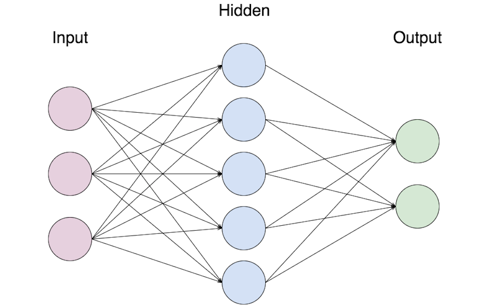

# 📚 Yapay Sinir Ağlarının Kavramları

Yapay Sinir Ağlarının temel kavramları

## 🍭 Temel Sinir Ağı

> **Convention:** Giriş katmanı sayılmadığından görüntüdeki NN 2 kat NN olarak adlandırılır 📢❗

## 📚 Terimler

| Terim            | Açıklama      |
| ---------------  |---------------|
| Giriş Katmanı    | NN'nin girişlerini içeren katmandır |
| Gizli Katman     | Hesaplamalı işlemlerin yapıldığı katman |
| Çıkış Katmanı    | NN'nin son katmanı ve tahmin edilen değerin _ŷ_ üretilmesinden sorumludur |
| Nöron            | Bir matematik fonksiyonu için bir yer tutucu, girdilere bir fonksiyon uygular ve çıktı sağlar |
| Aktivasyon Fonksiyonu | Dönüşümler uygulayarak bir düğümün giriş sinyalini bir çıkış sinyaline dönüştüren bir fonksiyon |
| Shallow NN       | Az sayıda gizli katmana sahip NN (bir veya iki)  |
| Deep NN          | Çok sayıda gizli katmanı olan NN |
| n[l]  | _l_ katmanındaki nöron sayısı |

## 🧠 Yapay bir nöron ne yapar?
It calculates a _weighted sum_ of its input, adds a bias and then decides whether it should be _fired_ or not due to an activaiton function
> My detailed notes on activaiton functions are [here](https://github.com/asmaamirkhan/DeepLearningNotes/tree/master/6-NNConcepts/3-ActivationFunctions.md) 👩‍🏫

## 👩‍🔧 Parameters Dimension Control

| Parameter        | Dimension     |
| ---------------  |---------------|
| w[<i>l</i>]   |  (n[<i>l</i>],n[<i>l-1</i>]) |
| b[<i>l</i>]   |  (n[<i>l</i>],1) |
| dw[<i>l</i>]  |  (n[<i>l</i>],n[<i>l-1</i>]) |
| db[<i>l</i>]  |  (n[<i>l</i>],1) |

> Making sure that these dimensions are true help us to write better and bug-free :bug: codes

## 🎈 Summary of Forward Propagation Process

|                  |                 |
| ---------------- | --------------- |
| **Input:**       |  a[<i>l</i>-1] |
| **Output:**      |  a[<i>l</i>], chache (z[<i>l</i>]) |

**Vectorized Equations:**

## 🎈 Summary of Back Propagation Process

|                  |                 |
| ---------------- | --------------- |
| **Input:**       |  da[<i>l</i>] |
| **Output:**      | da[<i>l</i>-1], dW[<i>l</i>], db[<i>l</i>] |

**Vectorized Equations:**

 

 

 

## ➰➰ To Put Forward Prop. and Back Prop. Together

> 😵🤕

## ✨ Parameters vs Hyperparameters

**Parameters:**
* W[<i>1</i>], W[<i>2</i>], W[<i>3</i>]
* b[<i>1</i>], b[<i>2</i>]
* ......

**Hyperparameters:**

* Learning rate
* Number of iterations
* Number of hidden layers
* Number of hidden units
* Choice of activation function
* ......

> We can say that hyperparameters control parameters 🤔