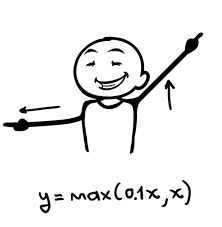

# 💥 Yapay Sinir Ağlarında Aktivasyon Fonksiyonları 
Aktivasyon Fonksiyonlarının temel amacı, bir A-NN'deki bir düğümün giriş sinyalini bir dönüşüm uygulayarak bir çıkış sinyaline dönüştürmektir.
Bu çıkış sinyali şimdi yığındaki bir sonraki katmana girdi olarak kullanılır.

## 📃 Types of Activaiton Functions

| Fonksiyon                    | Açıklama                                                  |
| ---------------------------- | --------------------------------------------------------- |
| Lineer Aktivasyon Fonksiyonu | Verimsiz, regresyonda kullanılır                          |
| Sigmoid Fonksiyonu           | İkili sınıflandırma problemlerinde çıktı katmanı için iyi |
| Tanh Fonksiyonu              | Sigmoid fonksiyonundan daha iyidir                        |
| Relu Fonksiyonu ✨          |  Gizli katmanlar için varsayılan seçim                     |
| Leaky Relu Fonksiyonu        |  Relu'dan birazcık daha iyi, Relu daha popüler            |

### 📈 Lineer Aktivasyon Fonksiyonu (Birim Fonksiyonu)

**Formül:**

**Grafik:**

> Regresyon problemlerindeki çıktı katmanında kullanılabilir. 

### 🎩 Sigmoid Fonksiyonu

**Formül:**

**Grafik:**

### 🎩 Tangent Fonksiyonu

Neredeyse her zaman sigmoid fonksiyonundan üstündür

**Formül:**

> Sigmoid fonksiyonunun kaydırılmış versiyonu 🤔

**Grafik:**

> Aktivasyon fonksiyonları farklı katmanlar için farklı olabilir, örneğin, gizli katman için  _tanh_ fonksiyonunu, çıkış katmanı için  _sigmoid_ fonksiyonunu kullanabiliriz 

### 🙄 Tanh ve Sigmoid Dezavantajları
Eğer z çok büyükse veya çok küçükse, bu fonksiyonun türevi _(veya eğimi)_ çok küçük olur (0'a yakın olur) ve bu, gradient descent'i yavaşlatabilir. 🐢

### 🎩 Doğrultulmuş Doğrusal Aktivasyon Ünitesi (Relu ✨) 
Başka ve çok popüler bir seçenek

**Formül:**

**Grafik:**

Yani türev, z pozitif olduğunda 1 ve z negatif olduğunda 0'dır.
> *Disadvantage:* z negatif iken türev=0'dır 😐

### 🎩 Sızdıran Relu

**Formül:**

**Grafik:**

**Veya:** 😛

### 🎀 Relu'nun Avantajları
* Z uzayının çoğu, aktivasyon fonksiyonunun türevi, 0'dan çok farklıdır.
* NN tanh veya sigmoid kullanmaya göre çok daha hızlı öğrenecektir. 

## 🤔 NN'lerin neden doğrusal olmayan aktivasyon fonksiyonlara ihtiyacı var?
Peki, eğer lineer işlevi kullanırsak, NN sadece girişin lineer bir fonksiyonunu çıkarır, yani NN'nin kaç katmanı olursa olsun 🙄, yaptığı tek şey sadece lineer bir fonksiyonu hesaplamaktır 😕

> ❗ İki doğrusal fonksiyonun kompozisyonunun kendisinin doğrusal bir fonksiyon olduğunu unutma

## 👩‍🏫 Aktivasyon Fonksiyonu Seçmek İçin Kurallar
* Eğer çıkış 0 veya 1 ise (ikili sınıflandırma) ➡ *sigmoid* çıkış katmanı için uygundur
* Diğer bütün birimler için ➡ *Relu* ✨ 
  
> Aktivasyon fonksiyonu için relu'nun varsayılan seçenek olduğunu söyleyebiliriz

Not:

> Bu fonksiyonlardan hangisinin en iyi sonucu verdiğinden emin değil isen 😵, hepsini dene 🤕 ve farklı validasyon seti üzerinden değerlendir ve hangisinin daha iyi çalıştığını gör ve kullan 🤓😇

## 🧐 Daha Fazla Oku
* [Which Activation Function Should I Use? (Siraj Raval :sparkles:)](https://www.youtube.com/watch?v=-7scQpJT7uo)
* [Activation Functions in Neural Networks](https://towardsdatascience.com/activation-functions-neural-networks-1cbd9f8d91d6)
* [Understanding Activation Functions in Neural Networks](https://medium.com/the-theory-of-everything/understanding-activation-functions-in-neural-networks-9491262884e0)
