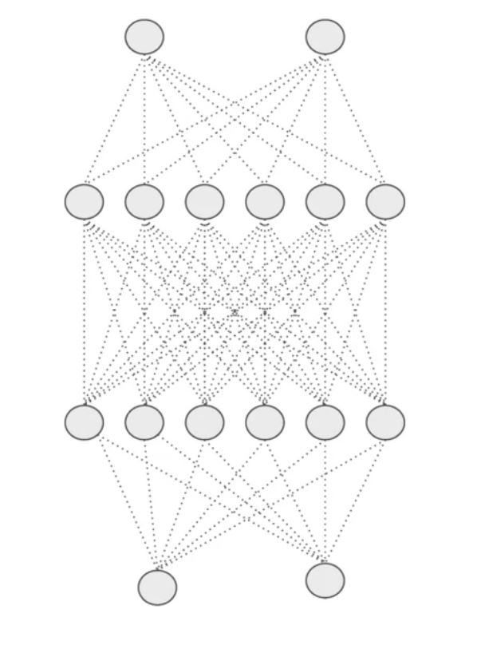

# 👩‍🔧 NN Düzenlileştirme (Regularization)
Kısaca: _overfitting_'i önleyen -ve varyansı- azaltan bir tekniktir

## 🙄 Problem
_Overfitting_ durumunda, modelimiz eğitim verilerindeki ayrıntıları ve daha önce görülmeyen veriler (test set) üzerinde düşük performansa neden olan gürültüyü çok iyi öğrenmeye çalışır.

Aşağıdaki grafik daha iyi açıklar:

## 👩‍🏫 Düzenlileştirme Daha İyi Tanımı
Modelin daha iyi genelleşmesi için öğrenme algoritmasında ufak değişiklikler yapan bir tekniktir. Bu da modelin görünmeyen veriler üzerindeki performansını artırmaktadır.

## 🔨 Düzenlileştirme Teknikleri

### 🔩 L2 Regularization (Weight decay)
En yaygın düzenlileştirme türüdür, aşağıdaki formüle göre uygulanır 

$$J=Loss+\frac{\lambda}{2m}-\sum ||w||^{2}$$

Burada, lambda regülasyon parametresidir. Daha iyi sonuçlar için değeri optimize edilmiş olan **hiperparametredir**. L2 regülasyonu, ağırlıkları sıfıra indirgemeye zorladığı için ağırlık azalması _(Weight decay)_ olarak da bilinir (ancak tam olarak sıfır değildir)

### 🔩 Dropout
Bazı nöronları **rastgele** belirli bir oranda elimine ederek başka bir düzenlileştirme yöntemi 

> Simply: For each node of probability p, don’t update its input or output weights during backpropagation (Just drop it 😅)

Daha iyi görselleştirme:

    
    

> Dropout işleminden önce ve sonra bir NN

Genellikle bilgisayarlı görüşte kullanılır, ancak olumsuz yönü _Cost FunctionJ_ artık iyi tanımlanmadığıdır.

### 🤡 Data Augmentation
_Overfitting_'i azaltmanın en basit yolu, eğitim verilerinin boyutunu artırmaktır, daha fazla veri elde etmek çok maliyetli olduğu için her zaman mümkün değildir, ancak bazen verilerimize dayanarak verilerimizi artırabiliriz, örneğin:

* Resimler üzerinde dönüşüm yapmak veri setimizi büyütebilir

### 🛑 Erken Durdurma
Eğitim setinin bir bölümünü doğrulama seti olarak tuttuğumuz bir tür çapraz doğrulama stratejisidir. Doğrulama setindeki performansın kötüye gittiğini gördüğümüzde, modelin eğitimini derhal durdururuz. Bu _Erken Durma_ olarak bilinir.

## 🧐 Daha Fazla Oku
* Uzun Lafın Kısası 😅: [Overfitting and Regularization in Neural Networks](https://medium.com/@rameshkjes/overfitting-and-regularization-in-neural-networks-d3d996e33c3)