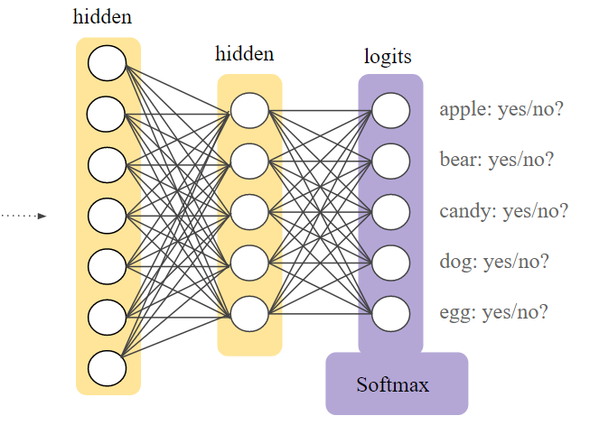

# 🎨 Softmax Regression
**Lojistik regresyona benzeterek anlayabiliriz:** 😋

Lojistik regresyonun 0 ile 1,0 arasında bir ondalıklı sayı ürettiğini hatırla, Örneğin, bir e-posta sınıflandırıcısından 0,8'lik bir lojistik regresyon çıktısı, bir e-postanın% 80'i spam olma olasılığını ve% 20'sinin spam olmadığını gösterir. Yani, bir e-postanın spam olma ve spam olmama ihtimalinin toplamı 1.0'dir.

Softmax bu fikri **ÇOKLU-SINIF** dünyasına genişletiyor. Yani, Softmax, her sınıfa çok sınıflı bir problemde ondalık olasılıklar verir. **Bu olasılıkların toplamı 1.0'e eşittir**.

* Onun diğer ismi _Maximum Entropy (MaxEnt) Classifier_

Softmax regresyonunun lojistik regresyonun genelleştirdiğini söyleyebiliriz.
> Lojistik regresyon, C = 2 olan softmax'ın özel bir durumudur 🤔

### 📚 Notasyon
C = sınıf sayısı = çıkış katmanının birim sayısı

Yani,  $$\hat{y}_j$$   (C, 1) boyutunda bir vektördür.

### 🎨 Softmax Katmanı
Softmax, çıktı katmanından hemen önce bir sinir ağı katmanı vasıtasıyla uygulanır. Softmax katmanı, çıkış katmanı ile aynı sayıda düğüme sahip olmalıdır.



### 💥 Softmax Aktivasyon Fonksiyonu

$$Softmax(x_i)\frac{exp(x_i)}{\sum_{j}exp(x_j)}$$

### 🔨 Hard Max Fonksiyonu 
Softmax katmanının çıktısını alır ve  _1 vs 0 vector_ (adlandırdığıma göre 🤭) vektörüne dönüştürür, o da bizim  _ŷ_'iz olacak

Örenğin:
```
t = 0.13  ==> ̂y = 0
    0.75          1
    0.01          0
    0.11          0
```
Ve bunun gibi 🐾

### 🔎 Kayıp Fonksiyonu

$$L(\hat{y},y)=-\sum_{j=1}^{c}y_jlog(\hat{y}_j)$$

> Y ve  ŷ (C,m) boyutunda matrislerdir 👩‍🔧

## 🌞 Yazının Aslı
- [Burada 🐾](https://dl.asmaamir.com/0-nnconcepts/7-multiclassclassification)

## 🧐 Daha Fazla Oku
* [Long story short from Google documentation](https://developers.google.com/machine-learning/crash-course/multi-class-neural-networks/softmax)