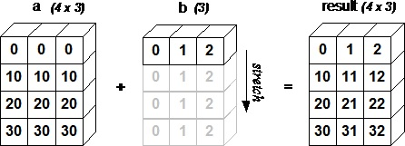

# 👷‍♀️ Yapay Sinir Ağlarının Uygulanması Üzerine Notlar

## 📚 Terimler

| Terim | Açıklama |
| :--- | :--- |
| 👩‍🔧 Vektörleştirme | Python kodunu döngü kullanmadan hızlandırma yöntemi |
| ⚙ Yayma _\(Broadcasting\)_ | Dizileri genişleterek Python kodunu daha hızlı çalıştırmak için başka bir yöntem |
| 🔢 Dizi Rankı | Bir dizinin sahip olduğu boyut sayısı |
| 1️⃣ Rank-1 Dizisi | Tek bir boyuta sahip bir dizi |

> Bir skalar sıfır rank'a sahip sayılır ❗❕

## 🔩 Vektörleştirme _\(Vectorization\)_

Vektörleştirme, Python veya Matlab kodunu döngü kullanmadan hızlandırmak için kullanılır. Onu kullanan bir fonksiyon kodun çalışma süresini verimli bir şekilde en aza indirmeye yardımcı olabilir. Vektörlerin _dot product_'ı, vektörlerin _outer products_'ı ve _element wise multiplication_ gibi vektör üzerinden çeşitli işlemler gerçekleştirilebilmektedir

### ➕ Avantajlar

* Daha hızlı \(paralel işlemlere izin verir\) 👨‍🔧
* Daha basit ve daha okunabilir kod ✨

### 👀 Görselleştirme


### 👩‍💻 Kod Örnekleri:

İki dizinin _dot product_'ını bulma:

```python
import numpy as np
array1 = np.random.rand(1000)
array2 = np.random.rand(1000)

# Vektorize edilmeyen versiyon
result=0
for i in range(len(array1)):
  result += array1[i] * array2[i]
# result: 244.4311

# Vektorize edilen versiyon
v_result = np.dot(array1, array2)
# v_result: 244.4311
```

#### 📈 Bir dizinin \(veya matrisin\) her elemanına üstel işlem uygulanması

```python
array = np.random.rand(1000)
exp = np.exp(array)
```

#### 🚀 Sigmoid Fonksiyonunun Vektörleştirilmiş Versiyonu

```python
array = np.random.rand(1000)
sigmoid = 1 / (1 + np.exp(-array))
```

### 👩‍💻 Numpy'de Ortak Desteklenen İşlemler

#### 🤸‍♀️ Ortak Tek Dizi Fonksiyonları

* Dizideki her elemanın karekökünü alma
  * `np.sqrt(x)`
* Dizinin tüm elemanlarının toplamını almak
  * `np.sum(x)`
* Dizideki her bir elemanın mutlak değerini alarak
  * `np.abs(x)`
* Dizideki her elemana **trigonometrik** fonksiyonlar uygulama
  * `np.sin(x)`, `np.cos(x)`, `np.tan(x)`
* Dizideki her bir eleman üzerine **logaritmik** fonksiyonlar uygulama
  * `np.log(x)`, `np.log10(x)`, `np.log2(x)`

#### 🤸‍♂️ Ortak Çoklu Dizi Fonksiyonları

* **Aritmetik** işlemleri dizilerdeki karşılık gelen elemanlara uygulama
  * `np.add(x, y)`, `np.subtract(x, y)`, `np.divide(x, y)`, `np.multiply(x, y)`
* Dizideki karşılık gelen elemanlara kuvvet işlemi uygulama
  * `np.power(x, y)`

#### ➰ Ortak Dizili _Sequence_ Fonksiyonlar

* Bir dizinin **ortalama**sını bulma
  * `np.mean(x)`
* Bir dizinin **medyan**ını bulma
  * `np.median(x)`
* Bir dizinin **varyans**ını bulma
  * `np.var(x)`
* Bir dizinin **standart sapma**sını bulma
  * `np.std(x)`
* Bir dizinin **maximum ve minimum** değerini bulma
  * `np.max(x)`, `np.min(x)`
* Bir dizinin maximum ve minimum değerinin **indis**ini bulma
  * `np.argmax(x)`, `np.argmin(x)`

## 💉 Yayma

Aritmetik işlemler sırasında numpy'nin farklı boyutlardaki dizileri nasıl ele aldığını açıklar. Bazı kısıtlamalara bağlı olarak, daha küçük dizi daha büyük dizi boyunca yayınlanır, böylece uyumlu şekillere sahip olurlar.

**Uygulamalı olarak:**

Elimizde `(m,n)` boyutundaki **A** matrisi olsun. `(1,n)` boyutundaki **B** matrisi ile toplamak / çıkarmak / çarpmak / bölmek istiyorsak, **B** matrisi `m` kez kopyalanacak, daha sonra istenen işlem gerçekleşecek.

Aynı şekilde: Elimizde `(m,n)` boyutundaki **A** matrisi olsun. `(m,1)` boyutundaki **B** matrisi ile toplamak / çıkarmak / çarpmak / bölmek istiyorsak, **B** matrisi `n` kez kopyalanacak, daha sonra istenen işlem gerçekleşecek.

> Uzun lafın kısası: Farklı boyutlardaki diziler \(veya matrisler\) eklenemez, çıkartılamaz veya genel olarak aritmetik olarak kullanılamaz. Dolayısıyla, boyutları genişletmek mümkün kılmanın bir yoludur, böylece uyumlu şekillere sahip olurlar.

### 👀 Görselleştirme



### 👩‍💻 Kod Örnekleri

\(1,n\) boyutundaki vektörü \(2,n\) boyutundaki matrise ekleme

```python
a = np.array([[0, 1, 2], 
              [5, 6, 7]] )
b = np.array([1, 2, 3])
print(a + b)

# Output: [[ 1  3  5]
#          [ 6  8 10]]
```

#### ➖ Bir matristen 'a' skalar çıkartma

```python
a = np.array( [[0, 1, 2], 
               [5, 6, 7]] )
c = 2
print(a - c)
# Output: [[-2 -1  0]
#          [ 3  4  5]]
```

## 1️⃣ Rank-1 Dizisi

### 👩‍💻 Kod Örneği

```python
x = np.random.rand(5)
print('shape:', x.shape, 'rank:', x.ndim)

# Output: shape: (5,) rank: 1

y = np.random.rand(5, 1)
print('shape:', y.shape, 'rank:', y.ndim)

# Output: shape: (5, 1) rank: 2

z = np.random.rand(5, 2, 2)
print('shape:', z.shape, 'rank:', z.ndim)

# Output: shape: (5, 2, 2) rank: 3
```

> Rank-1 dizilerinin kullanıl**ma**ması tavsiye edilmektedir

### 🤔 Neden kullanılmaması tavsiye edilir?

Rank-1 Dizileri, bulunması ve düzeltilmesi zor olan hatalara neden olabilir, örneğin:

Rank-1 dizilerindeki _dot_ işlemi:

```python
a = np.random.rand(4)
b = np.random.rand(4)
print(a)
print(a.T)
print(np.dot(a,b))

# Output
# [0.40464616 0.46423665 0.26137661 0.07694073]
# [0.40464616 0.46423665 0.26137661 0.07694073]
# 0.354194202098512
```

Rank-2 dizilerindeki _dot_ işlemi:

```python
a = np.random.rand(4,1)
b = np.random.rand(4,1)
print(a)
print(np.dot(a,b))

# Output
# [[0.68418713]
# [0.53098868]
# [0.16929882]
# [0.62586001]]
# [[0.68418713 0.53098868 0.16929882 0.62586001]]
# ERROR: shapes (4,1) and (4,1) not aligned: 1 (dim 1) != 4 (dim 0)
```

> Özet: Kodlarımızı daha hatasız ve kolay hata ayıklamak için rank-1 dizilerini kullanmaktan kaçınmalıyız 🐛

## 🌞 Yazının Aslı

* [Burada 🐾](https://dl.asmaamir.com/0-nnconcepts/2-implementationnotes)

## 🧐 Referanslar

* [Official Documentation of Broadcasting in NumPy](https://docs.scipy.org/doc/numpy/user/basics.broadcasting.html)

