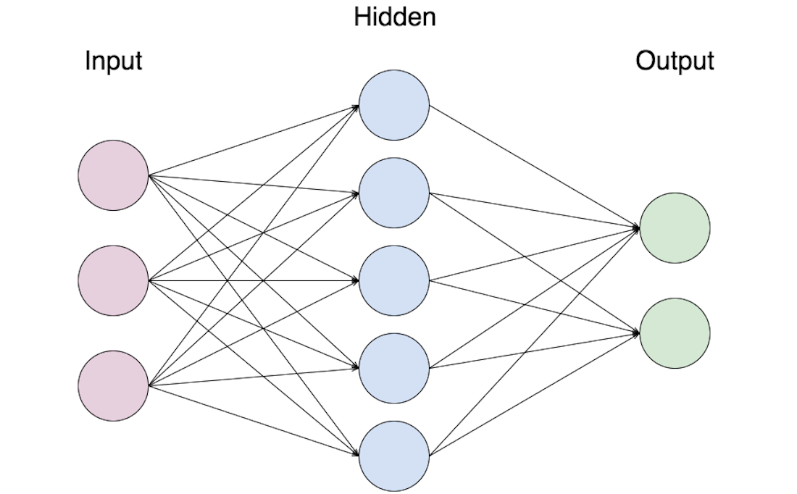

# 📚 Yapay Sinir Ağlarının Kavramları

Yapay Sinir Ağlarının temel kavramları

## 🍭 Temel Sinir Ağı

> **Convention:** Giriş katmanı sayılmadığından görüntüdeki NN 2 kat NN olarak adlandırılır 📢❗

## 📚 Terimler

| Terim | Açıklama |
| :--- | :--- |
| 🌚 Giriş Katmanı | NN'nin girişlerini içeren katmandır |
| 🌜 Gizli Katman | Hesaplamalı işlemlerin yapıldığı katman |
| 🌝 Çıkış Katmanı | NN'nin son katmanı ve tahmin edilen değer _ŷ_'nin üretilmesinden sorumludur |
| 🧠 Nöron | Bir matematik fonksiyonu için bir yer tutucu, girdilere bir fonksiyon uygular ve çıktı sağlar |
| 💥 Aktivasyon Fonksiyonu | Dönüşümler uygulayarak bir düğümün giriş sinyalini bir çıkış sinyaline dönüştüren bir fonksiyon |
| 👶 Shallow NN | Az sayıda gizli katmana sahip NN \(bir veya iki\) |
| 💪 Deep NN | Çok sayıda gizli katmanı olan NN |
| $$n^{[l]}$$ | _l_ katmanındaki nöron sayısı |

## 🧠 Yapay bir nöron ne yapar?

Girişinin ağırlıklı toplamını hesaplar, _bias_ ekler ve ardından bir aktivasyon fonksiyonu nedeniyle nöronun tetiklenip tetiklenmeyeceğine karar verir.

> Aktivasyon fonksiyonları ile ilgili ayrıntılı notlarım: [burada](https://dltr.asmaamir.com/0-nn-kavramlari/4-aktivasyon_fonksiyonlari) 👩‍🏫

## 👩‍🔧 Parametre Boyut Kontrolü

| Parametre | Boyut |
| :--- | :--- |
| $$w^{[l]}$$ | $$(n^{[l]},n^{[l-1]})$$ |
| $$b^{[l]}$$ | $$(n^{[l]},1)$$ |
| $$dw^{[l]}$$ | $$(n^{[l]},n^{[l-1]})$$ |
| $$db^{[l]}$$ | $$(n^{[l]},1)$$ |

> Bu boyutların doğru olduğundan emin olmak, daha iyi ve hatasız 🐛 kodlar yazmamıza yardımcı olur.

## 🎈 İleri Yayılım Sürecinin Özeti

|  |  |
| :--- | :--- |
| **Giriş:** | $$a^{[l-1]}$$ |
| **Çıkış:** | $$a^{[l]}, chache (z^{[l]})$$ |

### 👩‍🔧 Vektörize Edilmiş Denklemler:

$$Z^{[l]} =W^{[l]}A^{[l-1]}+b^{[l]}$$ $$A^{[l]} = g^{[l]}(Z^{[l]})$$

## 🎈 Geri Yayılım Sürecinin Özeti

|  |  |
| :--- | :--- |
| **Giriş:** | $$da^{[l]}$$ |
| **Çıkış :** | $$da^{[l-1]}, dW^{[l]}, db^{[l]}$$ |

**Vektörize Edilmiş Denklemler:**

$$dZ^{[l]}=dA^{[l]} * {g^{[l]}}'(Z^{[l]})$$

$$dW^{[l]}=\frac{1}{m}dZ^{[l]}A^{[l-1]T}$$

$$db^{[l]}=\frac{1}{m}np.sum(dZ^{[l]}, axis=1, keepdims=True)$$

$$dA^{[l-1]}=W^{[l]T}dZ^{[l]}$$

## ➰➰ İleri ve Geri Yayılımı Bir Arada

> 😵🤕

## ✨ Parametreler ve Hiper-parametreler

### 👩‍🏫 Parametreler

* $$W^{[1]}, W^{[2]}, W^{[3]}$$
* $$b^{[1]}, b^{[2]}$$
* ......

### 👩‍🔧 Hiper-parametreler

* Öğrenme hızı
* İterasyon sayısı
* Gizli katmanların sayısı
* Gizli birimlerin sayısı
* Aktivasyon Fonksiyonunun Seçimi 
* ......

> Hiper-parametrelerin parametreleri kontrol ettiğini söyleyebiliriz 🤔

## 🌞 Yazının Aslı

* [Burada 🐾](https://dl.asmaamir.com/0-nnconcepts/3-nnconcepts)

