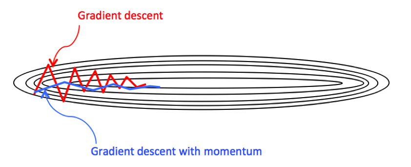

# ✨ Optimizasyon Algoritmaları

Hızlı ve iyi optimizasyon algoritmalarına sahip olmak tüm işin verimliliğini hızlandırabilir ✨

## 🔩 Bölümlü Gradyan İnişi \(Batch Gradient Descent\)

Bölümlü gradyan inişinde, gradyan inişinin her yinelemesi için maliyet fonksiyonunun gradyanını hesaplamak için **tüm** veri kümesini kullanırız ve ardından ağırlıkları güncelleriz.

* Tüm veri kümesini hesaplamada kullandığımızdan dolayı gradyanın yakınsaması yavaştır.

### 🎩 Stokastik Gradyan İnişi \(SGD\)

Stokastik Gradyan İnişi'nde, gradyanı hesaplamak ve ağırlıkları **her** bir yinelemeyle güncellemek için tek bir veri noktası veya örnek kullanıyoruz, önce tamamen rastgele bir veri setini alabilmemiz için önce veri kümesini karıştırmamız gerekir.

Rastgele örnek, global bir minimumda bulunmamızda yardımcı olur ve yerel bir minimumda sıkışıp kalmaktan kurtarır.

* Büyük bir veri kümesi için öğrenme çok daha hızlı ve yakınsama çok hızlı 🚀

### 🔩 Mini-Bölümlü Gradyan İnişi \(Mini Batch Gradient Descent\)

* Tek bir eğitim örneği yerine, örneklerin küçük bölümü kullanıldığı bir Stokastik Gradyan İnişinin bir varyasyonudur.
* Yaygın olarak kullanılır, daha hızlı yakınsar ve daha stabildir
* Bölüm büyüklüğü veri kümesine bağlı olarak değişebilir

> 1 ≤ batch-size ≤ m, batch-size bir hiper-parametredir ❗

### 🔃 Karşılaştırma

* Çok büyük `batch-size` \(m veya m'ye yakın\): 
  * Her yineleme için çok uzun
* Çok küçük `batch-size` \(1 veya 1'e yakın\)
  * Vektörleştirme hızını kaybetme
* Ne çok büyük ne çok küçük `batch-size`
  * Vektörleştirme yapabiliriz
  * Her yineleme için iyi hız
  * En hızlı \(en iyi\) öğrenme 🤗✨   

### 🚩 `Batch-Size` Seçmek İçin Kurallar

* Küçük bir veri kümesi için \(m ≤ 2000\) ➡ bölümlü gradyan inişi kullan
* Tipik mini batch-size: 64, 128, 256, 512, 1024'e kadar
* mini batch-size CPU / GPU belleğine sığdığından emin ol

> mini batch-size 2 kuvveti olarak seçmek daha iyidir \(daha hızlı\) \(bellek sorunları nedeniyle\) 🧐

## 🔩 Momentumlu Gradyan İnişi \(Gradient Descent with Momentum\)

Hemen hemen her zaman, gradient descent with momentum standart gradient descent algoritmasından daha hızlı yakınsar. Standart gradient descent algoritmasında, algoritmayı yavaşlatan bir yönde daha büyük ve başka bir yönde daha küçük adımlar atmamızdır 🤕

Bu momentumun geliştirebileceği şeydir, salınımı bir yönde kısıtlar, böylece algoritmamız daha hızlı yakınsayabilir. Ayrıca, y yönünde atılan adımların sayısı sınırlı olduğu için daha yüksek bir öğrenme hızı belirleyebiliriz 🤗

Aşağıdaki resim daha iyi anlatmaktadır: 🧐

**Formül:**

$$v_{dW} = \beta v_{dW }+ (1-\beta)dW$$

$$v_{db} = \beta v_{db }+ (1-\beta)db$$

$$W = W -\alpha v_{dW}$$

$$b = b -\alpha v_{db}$$

Daha iyi anlamak için:

Momentumlu gradyan inişinde, gradyan inişii hızlandırmaya çalışırken şunu söyleyebiliriz:

* Türevler hızlandırıcıdır
* v'ler hızdır
* _β_ sürtünmedir

## 🔩 RMSprop En İyileyicisi

RMSprop optimizer, momentumlu gradyan inişi algoritmasına benzer. RMSprop en iyileyicisi salınımları dikey yönde kısıtlar. Bu nedenle, öğrenme hızımızı artırabiliriz ve algoritmamız yatay doğrultuda daha hızlı yaklaşırken daha büyük adımlar atabilir.

RMSprop ve gradyan inişi arasındaki fark, gradyanlarım nasıl hesaplandığıdır, RMSProp gradyanları aşağıdaki formülle hesaplar:

$$S_{dW} = \beta S_{dW} + (1-\beta)dW^2$$

$$S_{db} = \beta S_{db} + (1-\beta)db^2$$

$$W = W -\alpha\frac{dW}{\sqrt{S_{dW}}}$$

$$b = b -\alpha\frac{db}{\sqrt{S_{db}}}$$

## ✨ Adam En İyileyicisi

Açılımı: **ADA**ptive **M**oment estimation

Günümüzde yaygın olarak kullanılan algoritmadır, Adam, RMSprop ve Stokastik Gradyan İnişi'nin momentum ile bir kombinasyonu olarak görülebilir. RMSprop gibi öğrenme hızını ölçeklendirmek için kare gradyanları kullanır ve momentum ile SGD gibi gradyan yerine gradyanın hareketli ortalamasını kullanarak momentumdan yararlanır.

> Özetle: Adam = RMSProp + GD with momentum + bias correction

$$v_{dW}=\beta_1v_{dW}+ (1-\beta_1)dW$$

$$v_{db}=\beta_1v_{db}+ (1-\beta_1)db$$

$$S_{dW}=\beta_2S_{dW}+ (1-\beta_2)dW^2$$

$$S_{db}=\beta_2S_{db}+ (1-\beta_2)db^2$$

$$v^{corrected}_{dW}=\frac{v_{dW}}{1-\beta^t_1}$$

$$v^{corrected}_{db}=\frac{v_{dW}}{1-\beta^t_1}$$

$$S^{corrected}_{dW}=\frac{S_{dW}}{1-\beta^t_2}$$

$$S^{corrected}_{db}=\frac{S_{db}}{1-\beta^t_2}$$

$$W = W-\alpha \frac{v^{corrected}_{dW}}{\sqrt{S^{corrected}_{dW}}+\epsilon}$$

$$b = b-\alpha \frac{v^{corrected}_{db}}{\sqrt{S^{corrected}_{db}}+\epsilon}$$

> 😵😵😵

## 👩‍🏫 Hiper-parametrelerin Seçimi \(önerilen değerler\)

* _α_: ayarlanması gerekiyor
* _β1_: 0.9
* _β2_: 0.999
* _ε_: $$10^{-8}$$

## 🌞 Yazının Aslı

* [Burada 🐾](https://dl.asmaamir.com/0-nnconcepts/7-optimization)

## 🧐 Referanslar

* [Machine learning Gradient Descent](https://medium.com/datadriveninvestor/gradient-descent-5a13f385d403)

