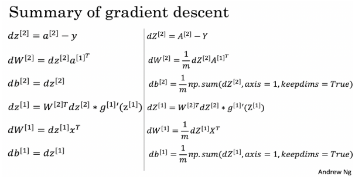

# 👩‍💻 Yapay Sinir Ağlarıyla ilgili Python Kod Parçaları

## 📚 ML'de Genel Kod Parçaları

### 💥 Sigmoid Fonksiyonu



$$sigmoid(x)=\frac{1}{1+exp(-x)}$$



```python
def sigmoid(x):
    """
    Argümanlar:
    x -- Skaler, dizi veya matris

    Dönüş değeri:
    result -- sigmoid(x)
    """

    result = 1 /( 1 + np.exp(-x) )

    return result
```



### 🚀 Sigmoid Gradient



_backpropagation_ kullanarak loss fonksiyonlarını optimize etmek için _gradient_'leri hesaplayan fonksiyon



$$\sigma^{'}(x)=\sigma(x)(1-\sigma(x))$$



```python
    def sigmoid_derivative(x):
    """
    Sigmoid fonksiyonunun gradient'ını (eğim veya türev olarak da adlandırılır), x girdisine göre hesaplar
    Argümanlar:
    x -- scaler veya Numpy dizisi

    Dönüş değeri:
    ds -- Hesaplanan gradient.
    """

    s = 1 / (1 + np.exp(-x))
    ds = s * (1 - s)

    return ds
```



### 👩‍🔧 Dizileri \(Veya resimleri\) Yeniden Şekillendirme



```python
    def arr2vec(arr, target):
     """
    Argümanlar:
    image -- (length, height, depth) boyutunda bir Numpy dizisi

    Dönüş değeri:
    v -- (length*height*depth, 1) boyutunda bir vektör
    """

    v = image.reshape(image.shape[0] * image.shape[1] * image.shape[2], 1)

    return v
```



### 💥 Satırları Normalize Etme



X'in her satır vektörünü normuna göre bölme.



$$Normalization(x)=\frac{x}{||x||}$$



```python
def normalizeRows(x):
    """
    Argümanlar:
    x -- (n, m) boyutunda bir Numpy dizisi

    Dönüş değeri:
    x -- Normalize edilmiş (satıra göre) Numpy matrisi.
    """

    # Normları hesaplama
    x_norm = np.linalg.norm(x, axis=1, keepdims=True)

    # x'i normuna bölme 
    x = x / x_norm

    return x
```



### 🎨 Softmax Fonksiyonu



Algoritmanın iki veya daha fazla sınıfı sınıflandırması gerektiğinde kullanılan normalleştirme fonksiyonu



$$Softmax(x_i)=\frac{exp(x_i)}{\sum_{j}exp(x_j)}$$



```python
 def softmax(x):
    """X girişinin her satırı için softmax değerini hesaplar.

    Argümanlar:
    x -- (n,m) boyutunda bir matris

    Dönüş değeri:
    s -- (X, m) şeklindeki softmax x değerine eşit bir matris matrisi
    """

    # Exp () element-wise komutunu x'e uygulama
    x_exp = np.exp(x)

    # X_exp'nin her satırını toplayan bir vektör x_sum oluşturma
    x_sum = np.sum(x_exp, axis=1, keepdims=True)

    # Softmax (x)'in x_exp'i x_sum ile bölerek hesaplanması.
    # numpy broadcasting otomatik olarak kullanılacak
    s = x_exp / x_sum

    return s
```



### 🤸‍♀️ L1 Loss Fonksiyonu



Kayıp, modelin performansını değerlendirmek için kullanılır. Kayıp ne kadar büyükse, tahminlerin \(ŷ\) gerçek değerlerden \(y\) o kadar farklı olmasıdır. Derin öğrenmede, modeli eğitmek ve maliyeti en aza indirmek için _Gradient Descent_ gibi optimizasyon algoritmaları kullanıyoruz.



$$L_1(\hat{y},y)=\sum_{i=0}^{m}(|y^{(i)}-\hat{y}^{(i)}|)$$



```python
def L1(yhat, y):
    """
    Argümanlar:
    yhat --  m boyutunda bir vektör (tahmin edilen etiketler)
    y -- m boyutunda bir vektör (doğru etiketler)

    Dönüş değeri: 
    loss -- yanda tanımlanan L1 fonksiyonunun değeri
    """

    loss = np.sum(np.abs(y - yhat))

    return loss
```



### 🤸‍♂️ L2 Loss Fonksiyonu



Kayıp, modelin performansını değerlendirmek için kullanılır. Kayıp ne kadar büyükse, tahminlerin \(ŷ\) gerçek değerlerden \(y\) o kadar farklı olmasıdır. Derin öğrenmede, modeli eğitmek ve maliyeti en aza indirmek için _Gradient Descent_ gibi optimizasyon algoritmaları kullanıyoruz.



$$L_2(\hat{y},y)=\sum_{i=0}^{m}(y^{(i)}-\hat{y}^{(i)})^2$$



```python
def L2(yhat, y):
    """
    Argümanlar:
    yhat -- m boyutunda bir vektör(tahmin edilen etiketler)
    y -- m boyutunda bir vektör(doğru etiketler)

    Dönüş değeri:
    loss -- yanda tanımlanan L1 fonksiyonunun değeri
    """

    loss = np.sum((y - yhat) ** 2)

    return loss
```



### 🏃‍♀️ Yayılma Fonksiyonu \(_Propagation Function_\)



Parametreleri öğrenmek için "ileri" ve "geri" yayılma adımlarını yapmak.



$$\frac{\partial J}{\partial w}=\frac{1}{m}X(A-Y)^T$$

$$\frac{\partial J}{\partial b}=\frac{1}{m}\sum_{i=1}^{m}(a^{(i)}-y^{(i)})$$



```python
def propagate(w, b, X, Y):
    """
    Cost fonksiyonunu ve gradient'leri hasaplamanın implementasyonu

    Argümanlar:
    w -- ağırlıklar, (num_px * num_px * 3, 1) boyutunda bir Numpy dizisi
    b -- önyargı (bias), bir skalerdir
    X -- (num_px * num_px * 3, örnek sayısı) boyutunda veriler
    Y -- doğru etiket vektörü (kedi değilse 0, kediyse 1), (1, örnek sayısı) boyutunda

    Dönüş değeri:
    cost -- lojistik regresyon için negatif log olabilirlik cost'u
    dw -- w'ye göre kaybın gradyanı, bu nedenle w ile aynı boyutta
    db -- b'ye göre kaybın gradyanı, bu nedenle b ile aynı boyutta

    """

    m = X.shape[1]

    # İLERİ YAYILMA (X’DEN MALİYETE)

    # aktivasyonu hesaplama
    A = sigmoid( np.dot(w.T, X) + b ) 

    # cost'u hesaplama
    cost = - np.sum( Y * np.log(A) + (1-Y) * np.log(1 - A) ) / m 

    # GERİ YAYILMA (GRAD'ı BULMAK İÇİN)

    dw = (np.dot(X,(A-Y).T))/m
    db = np.sum(A-Y)/m

    grads = {"dw": dw,
             "db": db}

    return grads, cost
```



### 💫 Gradyan İnişi _Gradient Descent_ \(Optimizasyon\)



Amaç, maliyet fonksiyonunu _J_'yi en aza indirerek _ω_ ve _b_'yi öğrenmektir.



$$w=w-\alpha dw$$

α öğrenme hızıdır _learning rate_



```python
def optimize(w, b, X, Y, num_iterations, learning_rate, print_cost = False):
    """
    gradient descent algoritması çalıştırarak w ve b'yi optimize eder

    Argümanlar:
    w -- ağırlıklar, (num_px * num_px * 3, 1) boyutunda bir Numpy dizisi
    b -- önyargı (bias), bir skalerdir
    X -- (num_px * num_px * 3, kayıt sayısı) boyutunda veriler
    Y -- doğru etiket vektörü (kedi değilse 0, kediyse 1), (1, örnek sayısı) boyutunda
    num_iterations -- optimizasyon döngüsünün iterasyon sayısı
    learning_rate -- gradient descent'in öğrenme hızı
    print_cost -- True ise kaybı her 100 adım yazdırır

    Dönüş değeri:
    params -- ağırlıkları ve bias'ı içeren bir dictionary
    grads -- cost fonksiyonuna göre ağırlıkları ve bias'ı içeren bir dictionary
    costs -- optimizasyon esnasında bütün kayıp değerlerini içeren bir list, öğrenme eğrisini çizerken kullanılacak
    """

    costs = []

    for i in range(num_iterations):


        # Cost ve gradient'ı hesaplama
        grads, cost = propagate(w, b, X, Y)

        # türevleri grad'lardan elde etme 
        dw = grads["dw"]
        db = grads["db"]

        # kuralı güncelleme
        w = w - learning_rate*dw
        b = b - learning_rate*db

        # cost'ları kaydetme
        if i % 100 == 0:
            costs.append(cost)

        # kaybı her 100 iterasyonda yazdırır (opsiyonel)
        if print_cost and i % 100 == 0:
            print ("Cost after iteration %i: %f" %(i, cost))

    params = {"w": w,
              "b": b}

    grads = {"dw": dw,
             "db": db}

    return params, grads, costs
```



## 🕸 Basit Bir NN Temel Kod Parçları

2 katmanlı ağın fonksiyonları

> Giriş katmanı, 1 gizli katman ve çıkış katmanı

### 🚀 Parametreleri Başlatma _Initialization_



`W`'leri ve `b`'leri başlatma konusunda, `W`'ler **Simetriği kırma** adına rastgele değerlerle başlatmalıyız, `b`'yi ise sıfır olarak başlatabiliriz.



```python
def initialize_parameters(n_x, n_h, n_y):
    """
    Argümanlar:
    n_x -- giriş katmanının boyutu
    n_h -- gizli katmanın boyutu
    n_y -- çıkış katmanının boyutu

    Dönüş değeri:
    params -- parametreleri içeren bir:
                    W1 -- (n_h, n_x) boyutundaki ağırlıklar matrisi
                    b1 -- (n_h, 1) boyutundaki bias vektörü
                    W2 -- (n_y, n_h) boyutundaki ağırlıklar matrisi
                    b2 -- (n_y, 1) boyutundaki bias vektörü
    """
    # değerleri küçültmek için 0.01 ile çarpma
    W1 = np.random.randn(n_h,n_x) * 0.01
    b1 = np.zeros((n_h,1))
    W2 = np.random.randn(n_y,n_h) * 0.01
    b2 = np.zeros((n_y,1))

    parameters = {"W1": W1,
                  "b1": b1,
                  "W2": W2,
                  "b2": b2}

    return parameters
```



### ⏩ İleri Yayılma



Her katman giriş verilerini alır, aktivasyon fonksiyonuna göre işler ve sonraki katmana geçirir



```python
def forward_propagation(X, parameters):
    """
    Argümanlar:
    X -- (n_x, m) boyutundaki giriş verileri
    parameters -- parametreleri içeren dictionary (başlatma fonksiyonunun çıkış değeri)

    Dönüş değeri:
    A2 -- ikinci aktivasyonun sigmoid çıkışı
    cache -- "Z1", "A1", "Z2" and "A2" değerlerini içeren dictionary
    """

    # parameters'den parametreleri elde etme
    W1 = parameters['W1']
    b1 = parameters['b1']
    W2 = parameters['W2']
    b2 = parameters['b2']

    Z1 = np.dot(W1, X) + b1
    A1 = np.tanh(Z1)
    Z2 = np.dot(W2, A1) + b2
    A2 = sigmoid(Z2)

    cache = {"Z1": Z1,
             "A1": A1,
             "Z2": Z2,
             "A2": A2}

    return A2, cache
```



### 🚩 Maliyet Fonksiyonu _Cost_



Çıkış katmanı nedeniyle ayarlanan **tüm** eğitimin _loss_ fonksiyonlarının ortalaması



$$J=-\frac{1}{m}\sum_{i=1}^{m}(y^{(i)}log(a^{[2](i)}) + (1-y^{(i)}log(1-a^{[2](i)})))$$



```python
def compute_cost(A2, Y):
    """
    Formülde verilen cross-entropy maliyetini hesaplar

    Argümanlar:
    A2 -- ikinci aktivasyonun sigmoid çıkışı, (1, örnek sayısı) boyutunda
    Y -- "true" etiket vektörü (1, örnek sayısı) boyutunda  

    Dönüş değeri:
    cost -- formülde verilen cross-entropy maliyeti

    """

    # örnek sayısı
    m = Y.shape[1] 

    # cross-entropy maliyetini hesaplama
    logprobs = np.multiply(np.log(A2), Y) + (1 - Y) * np.log(1 - A2)
    cost = - np.sum(logprobs) / m
    cost = float(np.squeeze(cost))  

    return cost
```



### ⏪ Geri Yayılma



Ağırlıkların uygun şekilde ayarlanması daha düşük hata oranlarını garanti eder ve modellemeyi genellemesini artırarak güvenilir kılar.







```python
def backward_propagation(parameters, cache, X, Y):
    """
    Daha önce verilen talimatları kullanarak geriye doğru yayılımı uygular

    Argümanlar:
    parameters -- parametrelerimizi içeren dictionary 
    cache -- "Z1", "A1", "Z2" and "A2" değerlerini içeren dictionary
    X -- (2, örnek sayısı) boyutundaki giriş verileri
    Y -- "true" etiket vektörü, (1, örnek sayısı) boyutunda

    Dönüş değeri:
    grads -- farklı parametrelere göre gradyanları içeren dictionary
    """
    m = X.shape[1]

    # parameters'dan W1 ve W2'yi elde etme
    W1 = parameters['W1']
    W2 = parameters['W2']

    # cache'den A1 ve A2'yi elde etme
    A1 = cache['A1']
    A2 = cache['A2']

    # Geri yayılma: calculating dW1, db1, dW2, db2 hesaplama 
    dZ2 = A2 - Y
    dW2 = np.dot(dZ2, A1.T) / m
    db2 = np.sum(dZ2, axis = 1, keepdims = True) / m
    dZ1 = np.dot(W2.T, dZ2) * (1 - A1 ** 2)
    dW1 = np.dot(dZ1, X.T) / m
    db1 = np.sum(dZ1, axis = 1, keepdims = True) / m

    grads = {"dW1": dW1,
             "db1": db1,
             "dW2": dW2,
             "db2": db2}

    return grads
```



### 🔃 Parametreleri Güncelleme



_Gradient descent_'i tamamlamak için öğrenme hızına bağlı olarak parametrelerin güncellenmesi



$$\theta := \theta - \alpha \frac{\partial J}{\partial \theta}$$



```python
def update_parameters(parameters, grads, learning_rate = 1.2):
    """
    Daha önce verilen gradient descent güncelleme kuralını kullanarak parametreleri günceller

    Argümanlar:
    parameters -- parametrelerimizi içeren dictionary 
    grads -- gradyanlarımızı içeren dictionary 

    Dönüş değeri:
    parameters -- güncellenmiş parametreleri içeren dictionary 
    """
    # "parameters"'dan parametreleri elde etme
    W1 = parameters['W1']
    b1 = parameters['b1']
    W2 = parameters['W2']
    b2 = parameters['b2']

    # "grads"dan gradyanları elde etme
    dW1 = grads['dW1']
    db1 = grads['db1']
    dW2 = grads['dW2']
    db2 = grads['db2']

    # Kuralı her parametre için güncelleme
    W1 = W1 - learning_rate * dW1
    b1 = b1 - learning_rate * db1
    W2 = W2 - learning_rate * dW2
    b2 = b2 - learning_rate * db2

    parameters = {"W1": W1,
                  "b1": b1,
                  "W2": W2,
                  "b2": b2}

    return parameters
```



## 🌞 Yazının Aslı

* [Burada 🐾](https://dl.asmaamir.com/0-nnconcepts/a-codesnippets)

