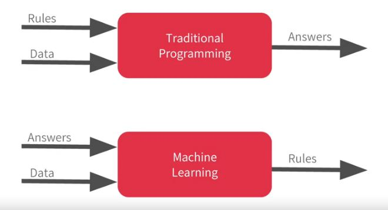

# 🙋‍♀️ Yapay Sinir Ağları ile Derin Öğrenme'nin Hello World'u
Her ilk uygulamada olduğu gibi, bize tüm metodoloji hakkında bir fikir veren süper basit bir şeyle başlamalıyız

## ✨ Keras Nedir?
Bir high-level **Yapay Sinir Ağları API'si**, Python ile yazılmış ve TensorFlow, CNTK veya Theano'nun üzerinde çalışabilir.

## 📚 Önemli Terimler
| Terim           | Açıkalama     |
| --------------- |---------------|
| Dense           | Bir sinir ağında bir nöron katmanı      |
| Loss Function   | Tahminlerinin ne kadar yanlış olduğunu ölçmenin matematiksel bir yolu |
| Optimizer       | Minimum kayıp fonksiyonunun _Loss Function_ değerine karşılık gelen parametre değerlerini bulmak için kullanan algoritma(lar) |

## 👩‍🔬 En Basit Sinir Ağı
Bir nöron içeren bir katman içerir.

### 👩‍💻 Kod Örneği
```python
# modeli tanımla
model = Sequential()

# tek birimli bir katman ekleme ve girişin boyutunu belirleme 
model.add(Dense(units=1, input_shape=[1]))

# fonksiyonel özellikleri belirleme ve modeli derleme
model.compile(optimizer='sgd', loss='mean_squared_error')
```

Yapay sinir ağını kurduktan sonra, onu örnek verilerimizle besleyebiliriz 😋

### 👩‍💻 Kod Örneği

```python
xs = np.array([-1.0,  0.0, 1.0, 2.0, 3.0, 4.0], dtype=float)
ys = np.array([-3.0, -1.0, 1.0, 3.0, 5.0, 7.0], dtype=float)
```
Şimdi, eğitim sürecini başlatmalıyız 🚀 

### 👩‍💻 Kod Örneği
```python
model.fit(xs, ys, epochs=500)
```
Her şey tamamlandı😎! Şimdi sinir ağımızı yeni verilerle test edebiliriz 🎉

### 👩‍💻 Kod Örneği
```python
print(model.predict([10.0]))
```

## 👩‍💻 Benim Kodum
- Tam kaynak kodu [burada 🐾](./HelloWorldWithTF.ipynb)

## 🔃 Geleneksel Programlamaya vs. Makine Öğrenmesi


## 🌞 Yazının Aslı
- [Burada 🐾](https://dl.asmaamir.com/1-helloworld)

## 🧐 Referanslar
* [Official Documentation of Keras](https://keras.io/)
* [More About Sequential model](https://keras.io/getting-started/sequential-model-guide/)
* [More About Optimizers in Keras](https://keras.io/optimizers/)
* [More About Loss Functions in Keras](https://keras.io/losses/)