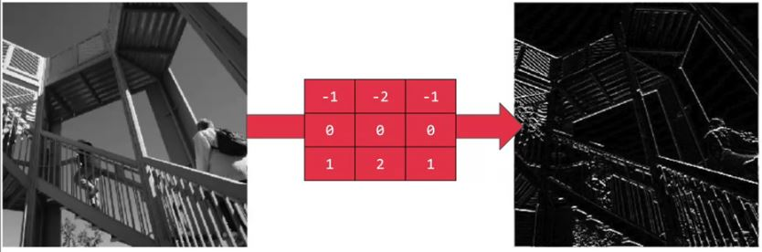

# 📌 Evrişimli Sinir Ağları ile İlgili Genel Kavramlar

## 📚 Önemli Terim
| Terim           | Açıklama      |
| --------------- |---------------|
| Convolution     | Görüntüye bir filtre uygulayarak görüntüdeki bazı özellikler vurgulanır. |


## 🎀 Convolution Örneği


#### 🤔 -7'yi nasıl bulduk? 
_element wise_ çarpma yaptık, sonra sonuç matrisinin toplamını hesapladık; yani:

```
3*1 + 1*0 + 1*(-1)
+
1*1 + 0*0 + 7*(-1)
+
2*1 + 3*0 + 5*(-1)
=
-7
```
Ve diğer elemanlar için bu şekilde devam eder 🙃

### 👼 Hesaplamayı Görselleştirme


## 🔎 Kenar Algılama
Evrişim _Convolution_ işleminin bir uygulaması

### 🔎 Kenar Algılama Örnekleri


> Sonuç: yatay çizgiler ortaya çıkıyor


> Sonuç: dikey çizgiler ortaya çıkıyor

### 🙄 Ya Diğer Sayılar?
Filtrenin elemanlarına sayı koyabileceğimiz pek çok yol var.

Örneğin, _Sobel_ filtresi bu şekildedir:

```
1   0   -1
2   0   -2
1   0   -1
```

_Scharr_ filtresi de bu şekildedir:

```
3    0   -3
10   0   -10
3    0   -3
```

>Yani buradaki kritik nokta orta satıra dikkat etmek.

### ✨ Başka Bir Yaklaşım
Bu sayıları ML yaklaşımı ile ayarlayabiliriz; Filtrenin bir ağırlık grubu olduğunu diyebiliriz, yani:

```
w1    w2   w3
w4    w5   w6
w7    w8   w9
```

Bu sayede, elle elde etmek yerine otomatik olarak yatay, dikey, açılı veya herhangi bir kenar tipini öğrenebiliriz.

## 🤸‍♀️ Hesaplamalı Detaylar
`n*n`'lik bir resmimiz varsa ve `f*f`'lik bir filtre uygulamak istersek, sonuç resmi `n-f+1*n-f+1` boyutunda olacaktır 

### 😐 Olumsuz Yanları
1. 🌀 Çok fazla filtre uygularsak, görselimiz küçülür.
2. 🤨 Köşelerdeki piksellere yeterince dokunulmadığından, görüntünün kenarlarından birçok bilgi göz ardı ediliyor

### 💡 Çözüm
Resimlere [_pading_](./1-CommonConcepts-P2.md#padding) işlemini uygulayabiliriz 💪 

## 🌞 Yazının Aslı
- [Burada 🐾](https://dl.asmaamir.com/3-cnnconcepts/0-commonconcepts)

## 🧐 Referanslar
* [More on Convolutional Neural Networks](https://www.youtube.com/playlist?list=PLkDaE6sCZn6Gl29AoE31iwdVwSG-KnDzF)
