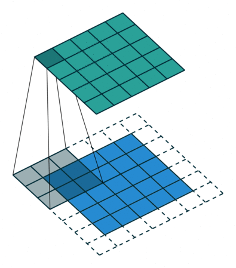
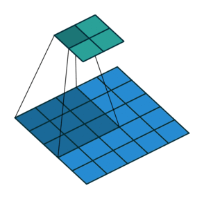
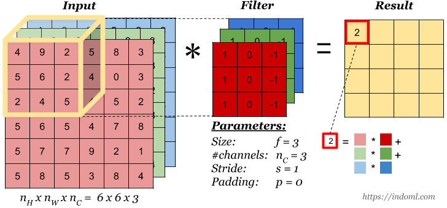

# 🌟 Advanced Concepts About Convolutional Neural Networks

## Important Terms
| Term                | Description   |
| ------------------- |---------------|
| 🔷 Padding             | Adding additional border(s) to the image before convolution  |
| 🌠 Strided Convolution | Convolving by `s` steps |
| 🏐 Convolutions Over Volume | Applying convs on n-dimensional input (such as an RGB image) |

## 🙌 Padding
Adding an additional one border _or more_ to the image so the image is n+2*n+2 and after convolution we end up with n * n image which is the origianl size of the image

`p` = number of added borders

> For convention: it is filled by 0

## 🤔 How much to pad?
For better understanding let's say that we have two concepts:

### 🕵️‍♀️ Valid Convolutions
It means no padding so:

`n x n`  *  `f x f`  ➡  `n-f+1 x n-f+1`

### 🥽 Same Convolutions
Pad so that output size is the **same** as the input size.

So we want that 🧐: 

`n+2p-f+1` = `n`

Hence:

`p` = `(f-1)/2`

> For convention f is chosen to be odd 👩‍🚀

### 👀 Visualization

## 🔢 Strided Convolution
Another approach of convolutions, we calculate the output by applying filter on regions by some value `s`. 

### 👀 Visualization 

## 🤗 To Generalize

For an `n*n` image and `f*f` filter, with `p` padding and stride `s`; the output image size can be calculated by the following formula

$$\left \lfloor{\frac{n+2p-f}{s}+1}\right \rfloor \times \left \lfloor{\frac{n+2p-f}{s}+1}\right \rfloor$$

## 🚀 Convolutions Over Volume
To apply convoltion operation on an RGB image; for example on 10x10 px RGB image, technically the image's dimension is 10x10x3 so we can apply for example a 3x3x3 filter _or fxfx3_ 🤳

> Filters can be applied on a special color channel 🎨

### 👀 Visualization

## 🤸‍♀️ Multiple Filters

## 🎨 Types of Layer In A Convolutional Network

| Layer                | Description   |
| -------------------- |---------------|
| 💫 Convolution `CONV`   | Filters to estract features |
| 🌀 Pooling `POOL`       | A technique to reduce size of representation and to speed up the computations |
| ⭕ Fully Connected `FC` | standard single neural network layer (one dimensional) |

> 👩‍🏫 Usually when people report number of layers in an NN they just report the number off layers that have weights and params 

> Convention: `CONV1` + `POOL1` = `LAYER1`

## 🤔 Why Convolotions?
- Better performance since they decrease the parameters that will be tuned 💫

## 🧐 References
- [Convolutional Neural Networks (CNN) Introduction (😍✨✨✨)](https://indoml.com/2018/03/07/student-notes-convolutional-neural-networks-cnn-introduction/)