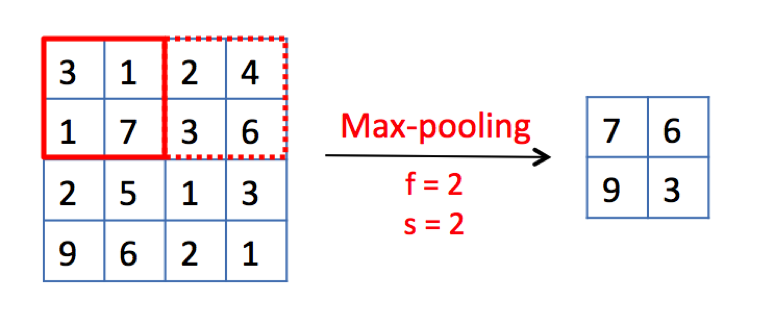
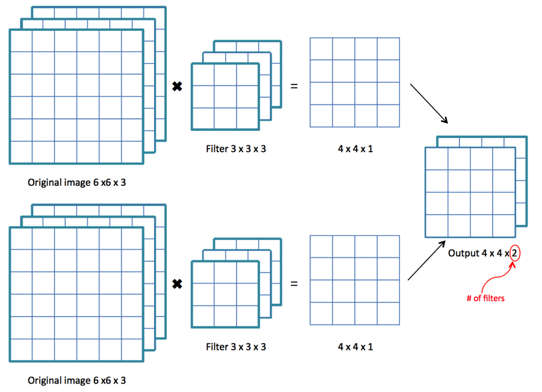

# 👀 Evrişimli Sinir Ağlarının Görselleştirilmesi
Kavramları toplamak için [P1](./0-GenelKavramlar.md) ve [P2](./1-GenelKavramlar-P2.md) 'de açıklanan kavramların görselleştirilmesi

### 💫 Convolution
Özellikleri çıkarmak için filtre uygulama 🤗

**Problem 😰:** Görüntüler küçülüyor 😱

### 😏 Padding'e Bir Göz At  

Görüntüler Çok Büyük, Performans Düşük 😔

### 😉 Pooling' Bakalım

### 🙄 Peki, RGB resmim var 
Filtrelerin renk kanalı sayısına eşit derinliğe sahip olması gerekir

### 🤡 Tamam, `n` tane filtre uygulamak istiyorum 
Çıktının derinliği `n` ye eşit olacaktır

## 🤗 Tam Bir Örnekle Anlamanı Kontrol Et 

## 🧐 Referanslar
- [DeepLearning series: Convolutional Neural Networks (😍✨✨✨)](https://medium.com/machine-learning-bites/deeplearning-series-convolutional-neural-networks-a9c2f2ee1524)