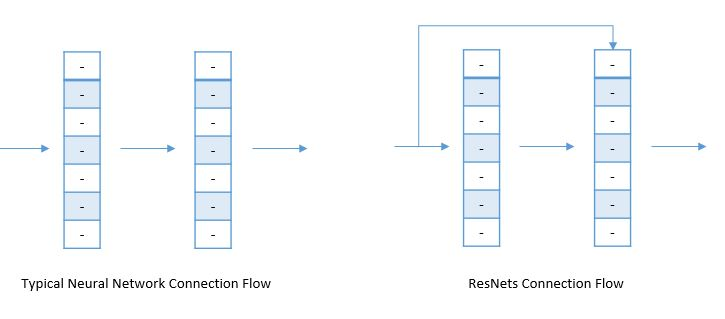

# ✨ CNN'leri Kurmak İçin Diğer Yaklaşımlar 
| Yaklaşım   | Açıklama      |
| ---------- |---------------|
| Residual Networks | Derin NN'lerde **vanishing gradient** sorununu önlemek için bir yaklaşım |
| One By One Convolution | **Renk Kanallarında** filtre uygulanması |

## 🔄 Residual Networks
### 🙄 Problem 
Bir sinir ağı eğitiminin her itersyon sırasında, tüm ağırlıklar, mevcut ağırlığa göre hata fonksiyonunun kısmi türeviyle orantılı bir güncelleme alır.
Eğer gradyan çok küçükse, ağırlıklar etkili bir şekilde değişmeyecek ve sinir ağını ileri eğitimden tamamen durdurabilir 🙄😪.

During each iteration of training a neural network, all weights receive an update proportional to the partial derivative of the error function with respect to the current weight. If the gradient is very small then the weights will not be change effectively and it may completely stop the neural network from further training 🙄😪. Bu olaya _vanishing gradients_ denir 🙁

> Basitçe 😅: Çok yavaş _gradient descent_ nedeniyle verilerin derin sinir ağının katmanları arasında kaybolduğunu söyleyebiliriz

ResNet'in ana fikri, aşağıdaki gibi bir veya daha fazla katmanı atlayan **identity shortcut connection** sunmaktır.

### 🙌 Düz Ağlar vs ResNet'ler

### 👀 Görselleştirme

## 🤗 Avantajlar
- Bloklardan birinin **identitiy** fonksiyonunu öğrenmesi kolay
- Performansa zarar vermeden daha derine gidebilir 
  - Düz NN'lerde, **vanishing and exploding gradients** problemleri nedeniyle, ağın performansı derinleştikçe azalmaktadır. 

## 1️⃣ One By One Convolutions
### Propblem (Yada motivasyon 🤔)
We can reduce the size of inputs by applying pooling and various convolution, these filteres can reduce the height and the width of the input image, what about color channels 🌈, in other words; what about the **depth**?

_Pooling_ ve çeşitli evrişim uygulayarak girişlerin boyutunu azaltabiliriz, bu filtreler girişin görüntüsünün yüksekliğini ve genişliğini azaltabilir; peki renk kuralları ne oluyor? 🌈, başka bir deyişle **derinliği** ne oluyor?

### 🤸‍♀️ Çözüm
Bir CNN çıktısının derinliğinin girişte uyguladığımız filtre sayısına eşit olduğunu biliyoruz;

Yukarıdaki örnekte **2** filtre uyguladık, böylece çıkış derinliği **2**

CNN'lerimizi geliştirmek için bu bilgiyi nasıl kullanabiliriz? 🙄

Let's say that we have a `28x28x192` dimensional input, if we apply `32` filters at `1x1x192` dimension and [SAME](./1-CommonConcepts-P2.md#same-convolutions) padding our output will become `28x28x32` ✨

Diyelim ki `28x28x192` boyutlu girişimiz var, `1x1x192` boyutunda `32` filtre ve [SAME](./1-GenelKavramlar-P2.md#same-convolutions) padding uygularsak çıkışımız `28x28x32` ✨

## 🌞 Yazının Aslı
- [Burada 🐾](https://dl.asmaamir.com/3-cnnconcepts/4-otherapproaches)

## 🧐 Daha Fazla Oku
- [Detailed ResNets](https://engmrk.com/residual-networks-resnets/)