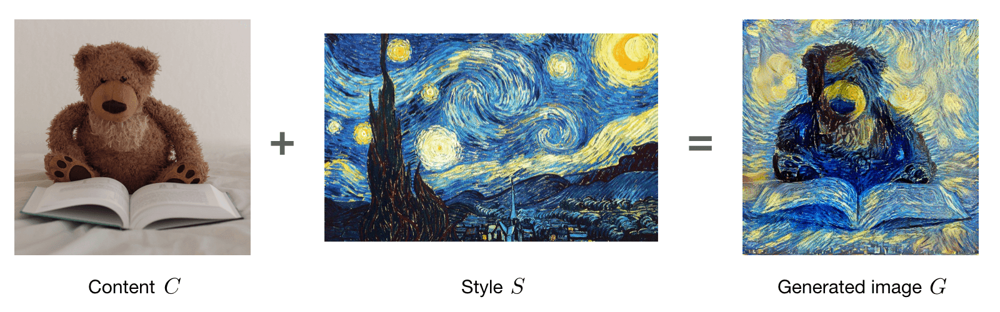

# 🕸 CNN'lerin Popüler Uygulamaları 

| Uygulama                  | Açıklama   |
| ------------------------- | ------------- |
| 🧒👧 Face Verification   | Verilen görüntünün ve ID'nin aynı kişiye ait olup olmadığını bilmek |
| 👸 Face Recognition       | Giriş yüzü görüntüsüne ID atama |
| 🌠 Neural Style Transfer  | Belirli bir görüntünün stilini öğrenerek bir görüntüyü diğerine dönüştürme  |

## 🧒👧 Face Verification
### 🙌 Karşılaştırma

| Terim                   | Soru                                     | Giriş           | Çıkış        | Problem Türü |
| ----------------------- | ---------------------------------------- | --------------- | ------------ | ------------- |
| 🧒👧 Face Verification | Bu aranan kişi mi? 🕵️‍♂️                    | Face image / ID | True / False | 1:1           |
| 👸 Face Recognition    | Bu kişi kimdir? 🧐                       | Face image      | `K` yüzünüz DB'deki ID'si | 1:K  |

## 🤸‍♀️ Çözüm Yaklaşımı

### 🤳 One Shot Learning
**Bir** örnekten (veritabanında sahip olduğumuz) kişiyi tekrar tanımayı öğrenmek

### 🖇 Süreç
- Giriş resmini al
- DB'deki yüzlere ait olup olmadığını kontrol et

### 👓 Nasıl Kontrol Edeyim?
> (Söyelemesi kolay 🤭)
Giriş görüntüsü ile veritabanındaki görüntü arasındaki **benzerliği** hesaplamamız gerekir, bu nedenle:

- ⭕ Öyle bir fonksiyon kullan ki; 
  - similarity(img_in, img_db) = some_val
- 👷‍♀️ Eşik değeri belirle
- 🕵️‍♀️ Eşik değerini kontrol et ve çıkışı belirle

### 🤔 Benzerlik fonksiyonu ne olabilir?

#### 🔷 Siamese Ağı
_Face verification_ bağlamında kullanılan bir CNN, iki görüntüyü girdi olarak alır, _convolution_'lar uyguladıktan sonra her görüntüden bir özellik vektörü hesaplar, aralarındaki farkı hesaplar ve daha sonra çıkışı verir.

> Başka bir deyişle: verilen resmi kodluyor

#### 👀 Görselleştirme

Mimarisi:

### 👩‍🏫 Nasıl Eğitebilirim?
Ağı bir _anchor_ (baz) resim _A_ alarak ve hem pozitif bir _P_ hem de negatif bir _N_ örneği ile karşılaştırarak eğitebiliriz. Böylece:
- 🚧 _Anchor_ resmi ile **pozitif** resim arasındaki benzeşmezlik (dissimilarity) **düşük** olmalıdır
- 🚧 _Anchor_ resmi ile **negatif** resim arasındaki benzeşmezlik (dissimilarity) **yüksek** olmalıdır

Yani:

$$L=max(d(a,p)-d(a,n)+margin, 0)$$

> Kayıp denklemine başka bir **hiper-parametre** olan *margin* adlı değişken eklenir. _Margin_, benzeşmezliğin ne kadar olması gerektiğini, yani eğer margin = 0.2 ve d(a, p) = 0.5 ise, d (a, n) en az 0.7'ye eşit olmalıdır. _Margin_, iki görüntüyü daha iyi ayırt etmemize yardımcı oluyor 🤸‍♀️

Bu nedenle, bu kayıp fonksiyonunu kullanarak:
- 👩‍🏫 Gradyanları hesaplayabiliriz ve gradyanların yardımıyla,
- 👩‍🔧 Siamese ağının ağırlıklarını ve _bias_'larını güncelleyebiliriz. 

Ağı eğitmek için de:
- 👩‍🏫 _Anchor_ görüntüsü alıyoruz ve pozitif ve negatif görüntüleri rastgele örnekleriz ve kayıp fonksiyonunu hesaplarız
- 🤹‍♂️ Gradyanları güncelliyoruz

## 🌠 Sinirsel Stil Aktarımı (Neural Style Transfer)
Bir içerik görüntüsü **C** (content) ve stil görüntüsü **S** (style) vererek bir **G** görüntüsü oluşturma

### 👀 Göreslleştirme

Bu nedenle **G**'yi üretmek için NN'miz **S**'nin özelliklerini öğrenmeli ve **C**'ye uygun filtreler uygulamalı.

### 👩‍🎓 Metodoloji
Genellikle istenen performansı elde etmek için NN'nin parametrelerini _-ağırlıklarını ve bias'larını-_ optimize ediyoruz, burada Sinirsel Stil Aktarımı'nda rastgele piksel değerlerinden oluşan boş bir görüntüden başlıyoruz ve görüntünün piksel değerlerini değiştirerek bir maliyet _cost_ fonksiyonunu optimize ediyoruz 🧐

Başka bir deyişle, biz:
- ⭕ **Rastgele** piksellerden oluşan bir resimle başlıyoruz
- 👩‍🏫 Bir maliyet (cost) _J_ fonksiyonunu tanımlıyoruz
- 👩‍🔧 Maliyet fonksiyonunu azaltmak için iteratif bir şekilde pikselleri güncelliyoruz

> Uzun lafın kısası: NN'leri eğitirken ağırlıkları ve bias'ları güncelleriz, ancak stil aktarımında ağırlıkları ve bias'ları sabit tutarız ve bunun yerine imajımızı güncelleriz 🙌

#### ⌚ Maliyet Fonksiyonu
_J_'yi aşağıdaki şekilde tanımlayabiliriz: 

$$J(G)=\alpha J_{Content}(C,G)+\beta J_{Style}(S,G)$$

Açıklama:
- $$J_{Content}$$ G ie C arasındaki benzerliği ifade eder
- $$J_{Style}$$ G ile S arasındaki benzerliği ifade eder
- _α_ ve _β_ hiper-parametrelerdir

## 🌞 Yazının Aslı
- [Burada 🐾](https://dl.asmaamir.com/3-cnnconcepts/5-applications)