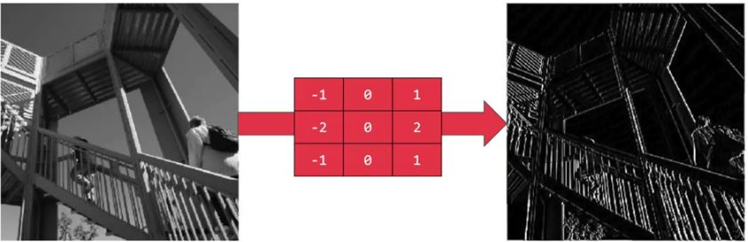

# 📌 Evrişimli Sinir Ağları ile İlgili Genel Kavramlar

## 📚 Önemli Terim

| Terim | Açıklama |
| :--- | :--- |
| Konvülosyon\(Convolution\) | Görüntüye bir filtre uygulayarak görüntüdeki bazı özellikler vurgulanır. |

## 🎀 Konvolüsyon Örneği


#### 🤔 -7'yi nasıl bulduk?

_element wise_ çarpma yaptık, sonra sonuç matrisinin toplamını hesapladık; yani:

```text
3*1 + 1*0 + 1*(-1)
+
1*1 + 0*0 + 7*(-1)
+
2*1 + 3*0 + 5*(-1)
=
-7
```

Ve diğer elemanlar için bu şekilde devam eder 🙃

### 👼 Hesaplamayı Görselleştirme


## 🔎 Kenar Algılama

Konvolüsyon işleminin bir uygulaması

### 🔎 Kenar Algılama Örnekleri


> Sonuç: yatay çizgiler ortaya çıkıyor



> Sonuç: dikey çizgiler ortaya çıkıyor

### 🙄 Ya Diğer Sayılar?

Filtrenin elemanlarına sayı koyabileceğimiz pek çok yol var.

Örneğin, _Sobel_ filtresi bu şekildedir:

```text
1   0   -1
2   0   -2
1   0   -1
```

_Scharr_ filtresi de bu şekildedir:

```text
3    0   -3
10   0   -10
3    0   -3
```

_Prewitt_ filtresi:

```text
-1   0   1
-1   0   1
-1   0   1
```

> Yani buradaki kritik nokta orta satıra dikkat etmek.

Ve _Roberts_ filtresi:

```text
1    0
0   -1
```

### ✨ Başka Bir Yaklaşım

Bu sayıları ML yaklaşımı ile ayarlayabiliriz; Filtrenin bir ağırlık grubu olduğunu diyebiliriz, yani:

```text
w1    w2   w3
w4    w5   w6
w7    w8   w9
```

Bu sayede, elle elde etmek yerine otomatik olarak yatay, dikey, açılı veya herhangi bir kenar tipini öğrenebiliriz.

## 🤸‍♀️ Hesaplamalı Detaylar

`n*n`'lik bir resmimiz varsa ve `f*f`'lik bir filtre uygulamak istersek, sonuç resmi `n-f+1*n-f+1` boyutunda olacaktır

### 😐 Olumsuz Yanları

1. 🌀 Çok fazla filtre uygularsak, görselimiz küçülür.
2. 🤨 Köşelerdeki piksellere yeterince dokunulmadığından, görüntünün kenarlarından birçok bilgi göz ardı ediliyor

### 💡 Çözüm

Resimlere [Dolgulama](2-genel-kavramlar-p2.md#dolgulama-padding) işlemini uygulayabiliriz 💪

## 🌞 Yazının Aslı

* [Burada 🐾](https://dl.asmaamir.com/3-cnnconcepts/1-commonconcepts)

## 🧐 Referanslar

* [More on Convolutional Neural Networks](https://www.youtube.com/playlist?list=PLkDaE6sCZn6Gl29AoE31iwdVwSG-KnDzF)

