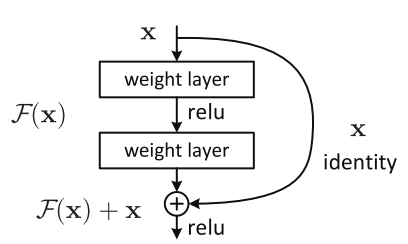
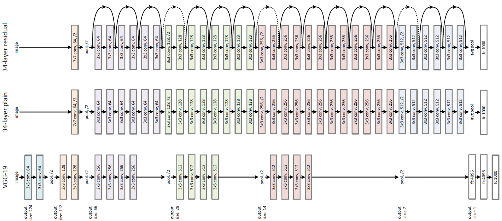

# ✨ CNN'leri Kurmak İçin Diğer Yaklaşımlar

| Yaklaşım | Açıklama |
| :--- | :--- |
| Artıklı Ağlar | Derin NN'lerde **kaybolan eğim** sorununu önlemek için bir yaklaşım |
| Bire bir konvolüsyon | **Renk Kanallarında** filtre uygulanması |

## 🔄 Artıklı Ağlar \(Residual Networks\)

### 🙄 Problem

Bir sinir ağı eğitiminin her iterasyon sırasında, tüm ağırlıklar, mevcut ağırlığa göre hata fonksiyonunun kısmi türeviyle orantılı bir güncelleme alır. Eğer gradyan çok küçükse, ağırlıklar etkili bir şekilde değişmeyecek ve sinir ağını ileri eğitimden tamamen durdurabilir 🙄😪. Bu olaya _**Kaybolan Eğim** \(vanishing gradients\)_ denir 🙁

> Basitçe 😅: Çok yavaş gradiyan inişi nedeniyle verilerin derin sinir ağının katmanları arasında kaybolduğunu söyleyebiliriz

ResNet'in ana fikri, aşağıdaki gibi bir veya daha fazla katmanı atlayan **identity shortcut connection** sunmaktır.

### 🙌 Düz Ağlar vs ResNet'ler

### 👀 Görselleştirme

## 🤗 Avantajlar

* Bloklardan birinin **identitiy** fonksiyonunu öğrenmesi kolay
* Performansa zarar vermeden daha derine gidebilir 
  * Düz NN'lerde, **Kaybolan ve Patlayan Gradyanlar** problemleri nedeniyle, ağın performansı derinleştikçe azalmaktadır. 

## 1️⃣ Bire Bir Konvolüsyon \(One By One Convolutions\)

### Propblem \(Yada motivasyon 🤔\)

_Sıkıştırma_ ve çeşitli evrişim uygulayarak girişlerin boyutunu azaltabiliriz, bu filtreler girişin görüntüsünün yüksekliğini ve genişliğini azaltabilir; peki renk kuralları ne oluyor? 🌈, başka bir deyişle **derinliği** ne oluyor?

### 🤸‍♀️ Çözüm

Bir CNN çıktısının derinliğinin girişte uyguladığımız filtre sayısına eşit olduğunu biliyoruz;

Yukarıdaki örnekte **2** filtre uyguladık, böylece çıkış derinliği **2**

CNN'lerimizi geliştirmek için bu bilgiyi nasıl kullanabiliriz? 🙄

Diyelim ki `28x28x192` boyutlu girişimiz var, `1x1x192` boyutunda `32` filtre ve [Dolgulamalı](https://github.com/asmaamirkhan/DeepLearningNotes-tr/tree/e17776b1b8771d34c5ad3be2b028a41ce37fe32c/3-CNNKonseptleri/1-GenelKavramlar-P2.md#same-convolutions) konvolüsyon uygularsak çıkışımız `28x28x32` ✨

## 🌞 Yazının Aslı

* [Burada 🐾](https://dl.asmaamir.com/3-cnnconcepts/5-otherapproaches)

## 🧐 Daha Fazla Oku

* [Detailed ResNets](https://engmrk.com/residual-networks-resnets/)

