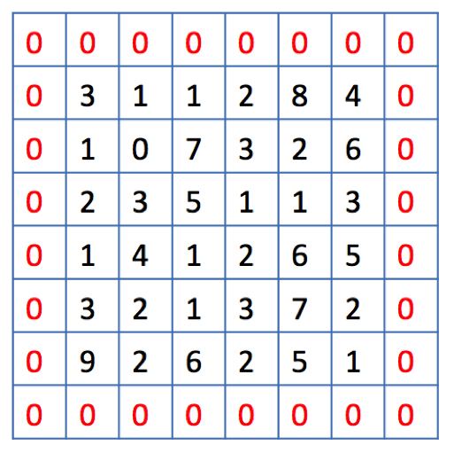
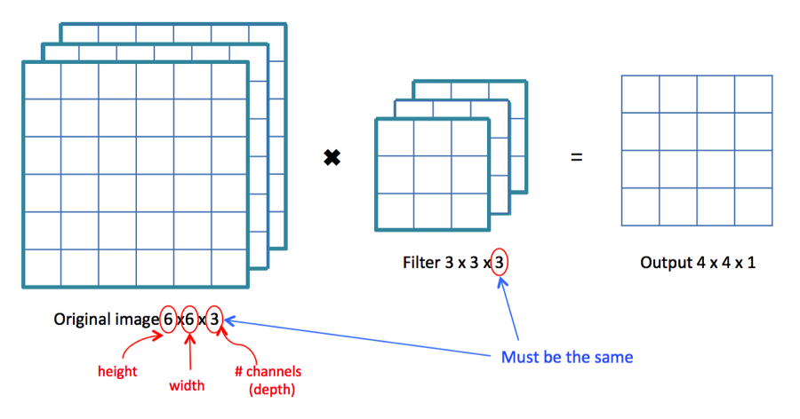

# 👀 Evrişimli Sinir Ağlarının Görselleştirilmesi

Kavramları toplamak için [P1](0-genelkavramlar.md) ve [P2](1-genelkavramlar-p2.md) 'de açıklanan kavramların görselleştirilmesi

### 💫 Konvolüsyon

Özellikleri çıkarmak için filtre uygulama 🤗

**Problem 😰:** Görüntüler küçülüyor 😱

### 😏 Dolgulamaya Bir Göz At

Görüntüler Çok Büyük, Performans Düşük 😔

### 😉 Pooling' Bakalım

### 🙄 Peki, RGB resmim var

Filtrelerin renk kanalı sayısına eşit derinliğe sahip olması gerekir

### 🤡 Tamam, `n` tane filtre uygulamak istiyorum

Çıktının derinliği `n` ye eşit olacaktır

## 🤗 Tam Bir Örnekle Anlamanı Kontrol Et

## 🌞 Yazının Aslı

* [Burada 🐾](https://dl.asmaamir.com/3-cnnconcepts/2-visualization)

## 🧐 Referanslar

* [DeepLearning series: Convolutional Neural Networks \(😍✨✨✨\)](https://medium.com/machine-learning-bites/deeplearning-series-convolutional-neural-networks-a9c2f2ee1524)

