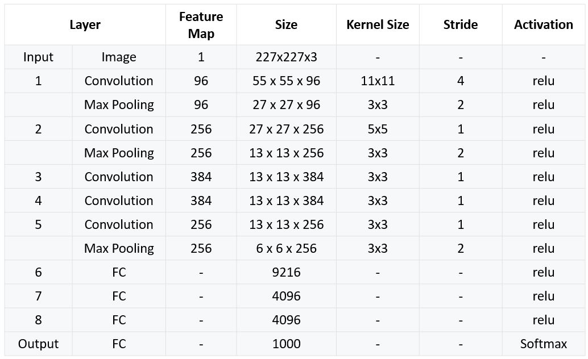
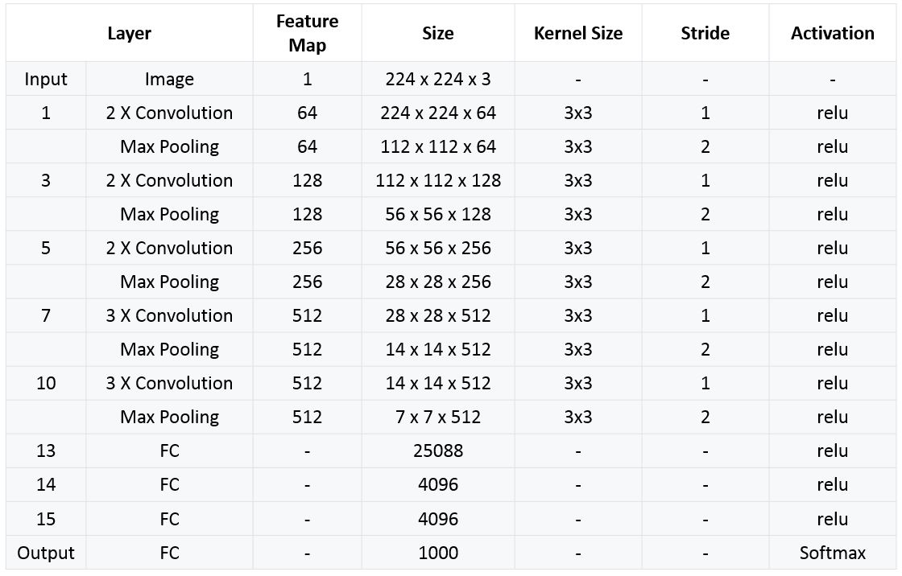

# 👵 Klasik Evrişimli Sinir Ağları

| Ağ | İlk Kullanım |
| :--- | :--- |
| LeNet-5 | Elle yazılmış basamak sınıflandırması |
| AlexNet | ImageNet Dataset |
| VGG-16 | ImageNet Dataset |

## 🔢 LeNet-5

LeNet-5 çok basit bir ağdır - Modern standartlara göre -. Sadece 7 katmanı vardır

* bunların arasında 3 konvolüsyon katmanı vardır _\(C1, C3 and C5\)_
* 2 sub-sampling \(sıkıştırma\) katmanları _\(S2 and S4\)_
* 1 tam bağlanmış katman _\(F6\)_
* Çıkış katmanı

### 👀 Ağın Görselleştirilmesi

### 🙌 Ağın Özeti

## 🛸 AlexNet

* LeNet-5' çok benziyor
* Katman başına daha fazla filtresi vardır
* _tanh_ yerine _ReLU_ kullanıyor
* _SGD_ with momentum
* regularaization yerine dropout kullanıyor

### 👀 Ağın Görselleştirilmesi

### 🔎 Daha Ayrınıtılı

### 🙌 Ağın Özeti

## 🌱 VGG-16

### 👀 Ağın Görselleştirilmesi

### 🙌 Ağın Özeti

### 🔎 Daha Ayrıntılı

### 😐 Olumsuz Yanları

* It is painfully slow to train \(It has 138 million parameters 🙄\)
* Eğitilmesi aşırı yavaş \(138 milyon parametresi var 🙄\)

## 👩‍🔧 Emplementasyon

* [Implementation of AlexNet](https://github.com/pytorch/vision/blob/master/torchvision/models/alexnet.py%20%20%20)

## 🌞 Yazının Aslı

* [Burada 🐾](https://dl.asmaamir.com/3-cnnconcepts/3-classiccnns)

## 🧐 Daha Fazla Oku

* [Detailed LeNet-5](https://engmrk.com/lenet-5-a-classic-cnn-architecture/)
* [Detailed AlexNet](https://engmrk.com/alexnet-implementation-using-keras/)
* [Detailed VGG-16](https://engmrk.com/vgg16-implementation-using-keras/)
* [Summary of classic networks](https://medium.com/analytics-vidhya/cnns-architectures-lenet-alexnet-vgg-googlenet-resnet-and-more-666091488df5)

