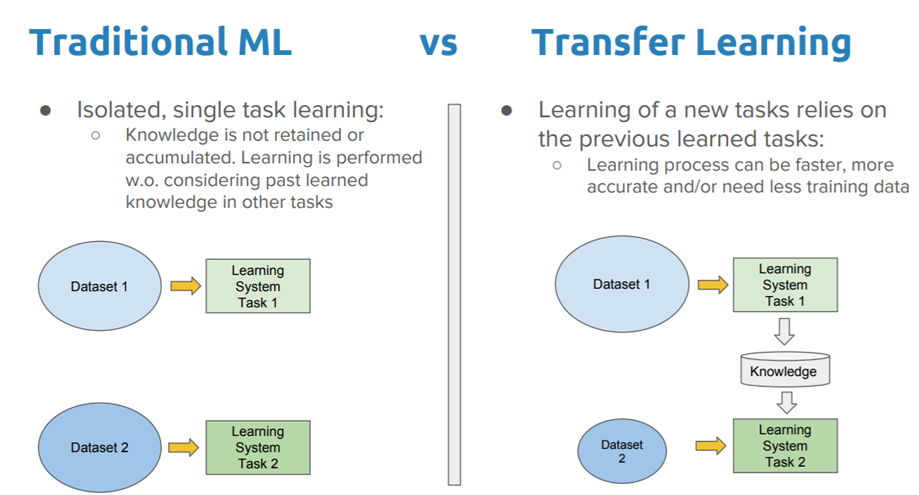
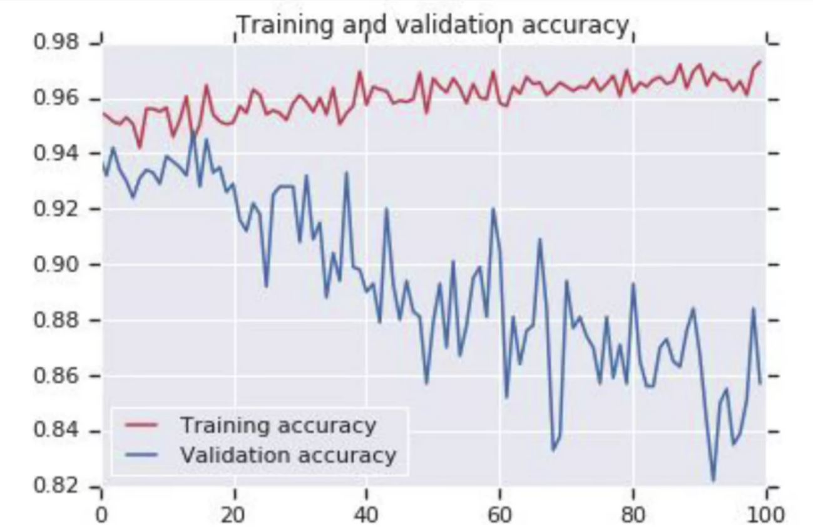
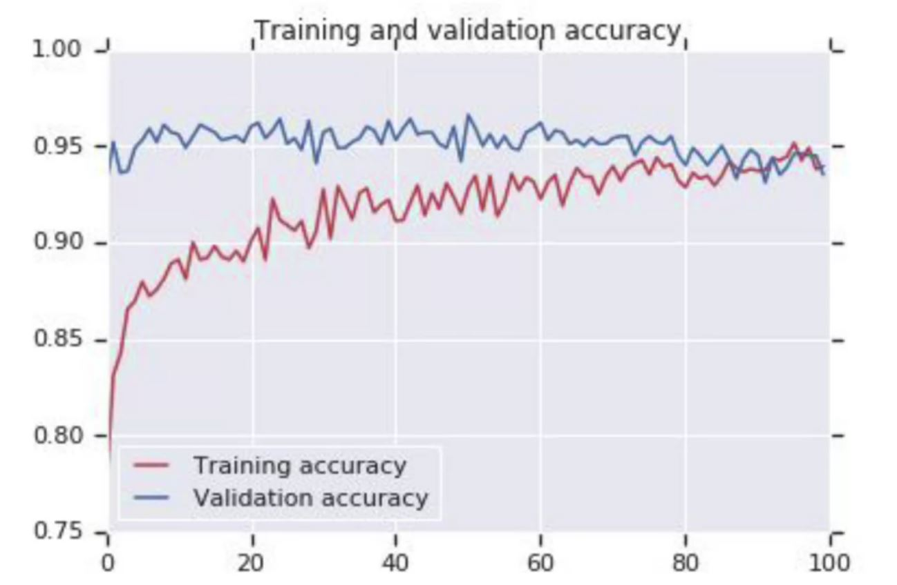

# 🚙 Transfer Learning
Kısaca: Bir görevden öğrenmek ve öğrenilenleri başka farklı görevler için kullanmak 🛰🚙

## ❓ Transfer Learning Nedir?
- 🕵️‍♀️ Transfer Learning, bir görev için eğitilmiş bir modelin, ilgili ikinci bir görevde yeniden kullanıldığı bir makine öğrenme tekniğidir. 
- 🌟 Ek olarak, ikinci görevi modellerken hızlı ilerleme veya gelişmiş performans sağlayan bir optimizasyon yöntemidir.. 
- 🤸‍♀️ Transfer Learning, yalnızca ilk görevden öğrenilen model özellikleri genel ise, derin öğrenmede işe yarar.

> Uzun lafın kısası: Bir sinir ağını sıfırdan eğitmek yerine, bir başkasının zaten haftalarca büyük bir veri setinde eğittiği açık kaynaklı bir model indirebiliriz ve bu parametreleri modelimizi elimizdeki biraz daha küçük veri setiyle eğitmek için başlangıç noktası olarak kullanabiliriz. ✨

## 💫 Geleneksel ML - Transfer Learning

## 🙄 Problem
Bir sinir ağındaki katmanlar bazen benzer ağırlıklara sahip olabilir ve birbirlerini **over-fitting** neden olacak şekilde etkileyebilirler. Büyük karmaşık bir model ile bu bir risktir. Yani eğer _Dense_ katmanlarını hayal ettiğimizde, biraz buna benzeyebilir.

Komşularla benzer ağırlıkları olan bazı nöronları kaldırabiliriz, böylece over fitting kaldırılır..

### 🔃 Karşılaştırma

    
    

> 🤸‍♀️ Dropout işleminden önce ve sonra bir NN

    
    

> ✨ Dropout işleminden önce ve sonra accuracy durumu

## 🤔 Ne zaman kullanılması pratiktir?
Kendisinden aktardığımız problem (kaynak) için çok fazla veriye sahip olduğumuzda ve aktardığımız problem (hedef) için genellikle nispeten daha az veri olduğunda pratiktir 🕵️‍

**Daha doğrusu:**

`görev A` ve `görev B` için, **A'dan B'ye** aktarmak aşağıdaki durumlarda makul olabilir:

* 🚩 Görev A ve görev B aynı çıkışa x sahipler ise
* ⭐ `görev A` için `görev B`'ye göre daha çok veriye sahip isek  
* 🔎 `görev A`'nın Düşük seviye özellikleri `task B`'yi öğrenmek için faydalı ise 

## 🌞 Yazının Aslı
- [Burada 🐾](https://dl.asmaamir.com/5-dlstrategies/a-transferlearning)

## 🧐 Referanslar
* [More about transfer learning in Tensorflow](https://www.tensorflow.org/tutorials/images/transfer_learning)
* [Understanding Dropout](https://www.youtube.com/watch?v=ARq74QuavAo)