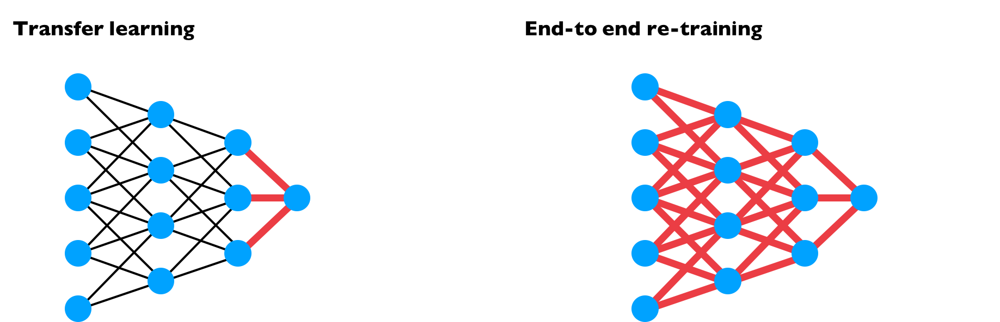

# 📚 Derin Öğrenmede Diğer Stratejiler

## ➰ Multi-Task Learning
Kısaca: Bir NN'nin aynı anda birkaç şey yapmasını sağlamaya başlıyoruz ve sonra bu görevlerin her biri diğer tüm görevlere yardımcı oluyor 🚀

**Başka bir deyişle:** Diyelim ki 4 nesne sınıfını tespit etmek için bir _detector_ kurmak istiyoruz, Her sınıf için 4 NN oluşturmak yerine, dört sınıfı tespit etmek için bir NN oluşturabiliriz 🤔 (Çıkış katmanı 4 birimlidir) 

### 🤔 Ne zaman kullanılması pratiktir?
* 🤳 Ortak **alt seviye özelliklere** sahip olmanın faydalarından yararlanabilecek görevlerle ilgili eğitim yapma durumunda 
* ⛱ Her görev için sahip olduğumuz veri miktarı oldukça benzer (_bazen_) ⛱
* 🤗 Tüm görevlerde başarılı olmak için yeterince büyük bir NN eğitebilir (her görev için ayrı bir ağ kurmak yerine) 

> 👓 Multi task learning transfer learning'e göre daha az kullanılır 

### 👀 Görselleştirme

## 🏴 End to End Deep Learning
- Özetle, Çok sayıda işlem aşaması gerektiren bazı veri işleme sistemleri veya öğrenme sistemleri olduğundan, 
- End to end learning tüm bu çoklu aşamaları alabilir ve sadece tek bir NN ile değiştirebilir

> 👩‍🔧 Uzun lafın kısası: aynı NN ile büyük görevi alt küçük görevlere bölmek

### ➕ Avantajlar:

* 🦸‍♀️ Verinin gücünü gösterir
* ✨ Less hand designing of components needed

### ➖ Dezavantajlar:

* 🤸‍♀️ Büyük miktarda veriye ihtiyaç olabilir
* 🔎 Excludes potentially useful hand designed components

### 🚩 Kullanma Kararını Verme İçin Talimatlar
**Anahtar soru:** x ile y arasında eşlemek için gereken karmaşıklığın bir fonksiyonunu öğrenmek için yeterli veriye sahip misin?

## 🔃 End to End Learning vs Transfer Learning

