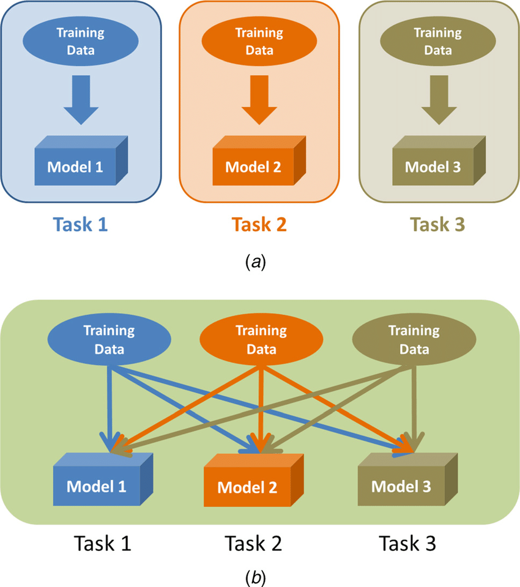

# 📚 Derin Öğrenmede Diğer Stratejiler

## ➰ Çoklu Görev Öğrenmesi \(Multi-Task Learning\)

Kısaca: Bir NN'nin aynı anda birkaç şey yapmasını sağlamaya başlıyoruz ve sonra bu görevlerin her biri diğer tüm görevlere yardımcı oluyor 🚀

**Başka bir deyişle:** Diyelim ki 4 nesne sınıfını tespit etmek için bir algılayıcı kurmak istiyoruz, Her sınıf için 4 NN oluşturmak yerine, dört sınıfı tespit etmek için bir NN oluşturabiliriz 🤔 \(Çıkış katmanı 4 birimlidir\)

### 🤔 Ne zaman kullanılması pratiktir?

* 🤳 Ortak **alt seviye özelliklere** sahip olmanın faydalarından yararlanabilecek görevlerle ilgili eğitim yapma durumunda 
* ⛱ Her görev için sahip olduğumuz veri miktarı oldukça benzer \(_bazen_\) ⛱
* 🤗 Tüm görevlerde başarılı olmak için yeterince büyük bir NN eğitebilir \(her görev için ayrı bir ağ kurmak yerine\) 

> 👓 Çoklu görev öğrenmesi, öğrenme aktarmasına göre daha az kullanılır

### 👀 Görselleştirme

## 🏴 End to End Deep Learning

* Özetle, Çok sayıda işlem aşaması gerektiren bazı veri işleme sistemleri veya öğrenme sistemleri olduğundan, 
* End to end learning tüm bu çoklu aşamaları alabilir ve sadece tek bir NN ile değiştirebilir

> 👩‍🔧 Uzun lafın kısası: aynı NN ile büyük görevi alt küçük görevlere bölmek

### ➕ Avantajlar:

* 🦸‍♀️ Verinin gücünü gösterir
* ✨ İşleiyişin tasarımına daha az elle müdahele edilir

### ➖ Dezavantajlar:

* 💔 Büyük miktarda veriye ihtiyaç olabilir
* 🔎 Excludes potentially useful hand designed components
  * Çeviremedim 😢

### 🚩 Kullanma Kararını Verme İçin Talimatlar

**Anahtar soru:** x ile y arasında eşlemek için gereken karmaşıklığın bir fonksiyonunu öğrenmek için yeterli veriye sahip misin?

## 🔃 End to End Learning vs Aktarma Öğrenmesi

## 🌞 Yazının Aslı

* [Burada 🐾](https://dl.asmaamir.com/5-dlstrategies/c-otherstrategies)

