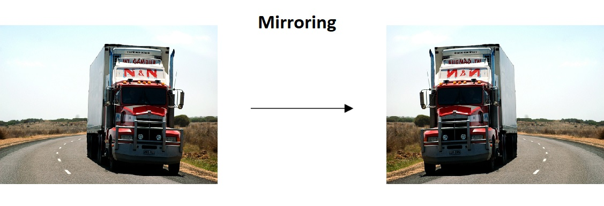
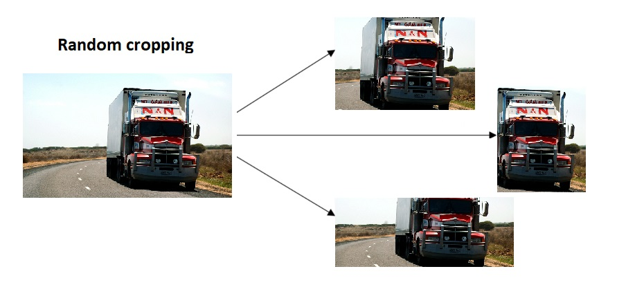
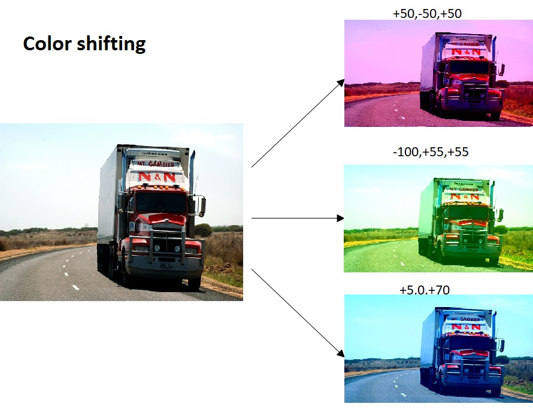

# 🤡 Image Augmentation
- 💥 Basics of Image Augmentation which is a technique to avoid overfitting
- ⭐ When we have got a small dataset we are able to manipluate the dataset without changing the underlying images to open up whole scenarios for training and to be able to train by variuos techniques of image augmentation 

> Note: Image augmentation is needed for both training and test set 😅

## 🚩 Basic Concept of Image Augmentation

👩‍🏫 The concept is very simple though:

If we have limited data, then the chances of you having data to match potential future predictions is also limited, and logically, the less data we have, the less chance we have of getting accurate predictions for data that our model hasn't yet seen.

> 🙄 If we are training a model to spot cats, and our model has never seen what a cat looks like when lying down, it might not recognize that in future.

- Augmentation simply amends our images on-the-fly while training using **transforms** like rotation. 
- So, it could 'simulate' an image of a cat lying down by rotating a 'standing' cat by 90 degrees. 
- As such we get a cheap :sparkles: way of extending our dataset beyond what we have already.

> 🔎 Note: Doing image augmentation in runtime is prefered rather than to do it on memory to keep original data as it is 🤔


## 🤸‍♀️ Image Augmentation Techniques
### ✅ Mirroring 
Flipping the image horizontally

#### 🚀 Example



### ✂ Random Cropping 
Picking an image and taking random crops

#### 🚀 Example


### 🎨 Color Shifting 
Adding and subtracting some values from color channels

#### 🚀 Example



## 👩‍💻 Code Example

The following code is used to do image augmentation

```python
from tensorflow.keras.preprocessing.image import ImageDataGenerator

train_datagenerator = ImageDataGenerator(
      rescale = 1./255,
      rotation_range = 40,
      width_shift_range = 0.2,
      height_shift_range = 0.2,
      shear_range = 0.2,
      zoom_range = 0.2,
      horizontal_flip = True,
      fill_mode = 'nearest')
```

| Parameter       | Description   |
| --------------- |---------------|
| `rescale` | Rescaling images, NNs work better with normalized data so we rescale images so values are between 0,1 |
| `rotation_range` | A value in degrees (0–180), a range within which to randomly **rotate** pictures    |
| Height and width shifting |  Randomly shifts pictures vertically or horizontally |
| `shear_range` | Randomly applying shearing transformations |
| `zoom_range` | Randomly zooming inside pictures |
| `horizontal_flip` | Randomly flipping half of the images horizontally |
|  `fill_mode` | A strategy used for filling in newly created pixels, which can appear after a rotation or a width/height shift. |


> Full code example is [here 🐾](./0-ImageAugmentation.ipynb) 👈

## 🧐 References
* [More About Image Augmentation](https://github.com/keras-team/keras-preprocessing)
* [More About Image Pre-processing](https://keras.io/preprocessing/image/)
* [Detailed Image Augmentation Techniques](http://datahacker.rs/020-cnn-data-augmentations/)

