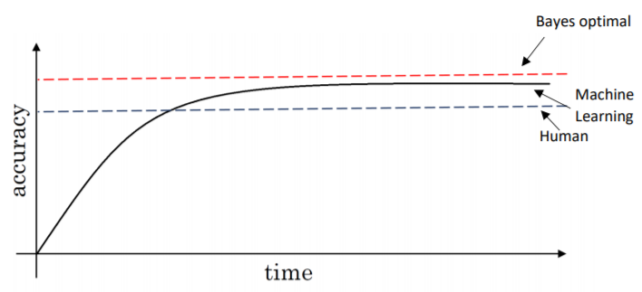

# 👩‍🏫 Uygulama Talimatları

## 📚 Popüler Terimler

| Terim | Açıklama |
| :--- | :--- |
| 👩‍🎓 Bayes Error | Herhangi bir sınıflandırıcı için olası **en düşük** hata oranı \(Optimum hata 🤔\) |
| 👩‍🏫 Human Level Error | Bir insan tarafından elde edilebilecek hata oranı |
| 👮‍♀️ Avoidable Bias ‍ | Bayes hatası ile insan seviyesi hatası arasındaki fark |

## Elimden gelenin en iyisini yaptım, projem hala kötü gidiyor, ne yapmalıyım? 😥

Peki, bu aşamada bir kriterimiz var, senin modelin insanlardan daha mı kötü yapıyor \(Çünkü insanlar birçok işte oldukça iyilerdir 👩‍🎓\)? Evet ise, aşağıdakileri denyebilirsin:

* 👩‍🏫 İnsanlardan etiketli veriler  al
* 👀 Manuel hata analizinden fikir edinmeye çalış; \(Bir insan neden bunu doğru yapabiliyor 🙄\) 
* 🔎 bias / variance 'ı daha iyi anlaliz et 🔍

> 🤔 Not: İnsanların bir görevde ne kadar iyi yapabileceklerini bilmek, bias'ı ve varyansı azaltmaya ne kadar çalışmamız gerektiğini daha iyi anlamamıza yardımcı olabilir

### 🧐 Modelin insanlardan daha mı iyi?

* İşlemler daha az net 😥

> Uygun teknikler buraya eklenecektir

## 🤓 Study case

Aşağıdaki iki durumun olduğunu varsayalım:

|  | Durum1 | Durum2 |
| :--- | :---: | :---: |
| Human Error | 1% | 7.5% |
| Training Error | 8% | 8% |
| Dev Error | 10% | 10% |

Training ve dev hataları aynı olsa bile, daha iyi performans için farklı taktikler uygulayacağız

* **Durum1**'de, `Yüksek Bias` vardır, o yüzden _yanlılık azaltma tekniklerine_ odaklanmamız lazım 🤔, başka bir deyişle, training ve insan hatası arasındaki farkı azaltmamız gerekmektedir, ona da **the avoidable error** denir.
  * Daha iyi algoritma, daha iyi NN yapısı, ......
* **Durum2**'de, `Yüksek Varyans` vardır, o yüzden _varyans azaltma tekniklerine_ odaklanmamız lazım 🙄, başka bir deyişle training ve dev hatalarının arasındaki farkı azaltmamız lazım
  * regularization ekleme, daha çok veri elde etme, ......

> Bu analiz sürecine **Error analysis** denir 🕵️‍

## 👀 Hata Türlerinin Görselleştirilmesi

> Bilgisayar görüşü problemlerinde, `human-level-error ≈ bayes-error` çünkü insanlar görüş prblemlerinde çok iyiler

## 🤗 ML'nin insan seviyesi performansını geçebildiği problemler

* Online reklamcılık
* Ürün önerme
* Logistics
* Kredi onayları
* .....

## ✨ Bias / Varyans ve İlgili Prosedürler Hakkında Detaylı Notlarım

* [Burada 🐾](../0-nn-kavramlari/5-pratik_notlar.md)

## 🤸‍♀️ Tavsiyeler

Yeni bir projemiz olduğunda, bir ilk model üretmek ve ardından en iyi modeli elde edene kadar iteratif bir şekilde ilerlemek önerilir, Bu, teorik olarak zamanı modeli oluşturma harcamaktan ve en iyi hipermetreyi düşünmekten daha pratiktir. _-bu da neredeyse imkansız 🙄-_

> O yüzden sadece aşırı düşünme! **\(Hem ML problemlerinde hem de hayat problemlerinde 🤗🙆‍\)**

## 🌞 Yazının Aslı

* [Burada 🐾](https://dl.asmaamir.com/7-appliedml/2-guidelines)

