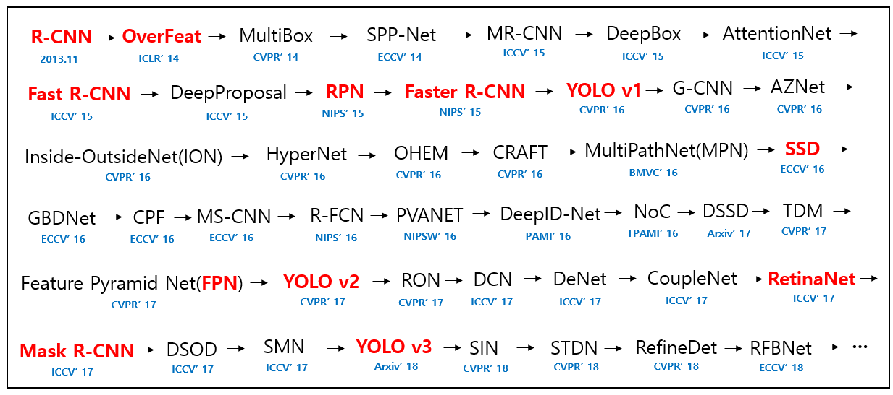

# 🌱 Giriş

## 📚 Popüler Terimler

| Terim                | Açıklama                                       |
| -------------------- | ---------------------------------------------- |
| Classification       | Giriş görüntüsündeki bir objenin etiketini (sınıfını) belirtme |
| Classification and Localization | Giriş görüntüsündeki bir nesnenin etiketini ve koordinatlarını belirtme |
| Object Detection     |  Giriş görüntüsündeki birden fazla nesnenin etiketlerini ve koordinatlarını belirtme |

## 📑 Daha Detaylı

|             | Classification | Clf. and Localization | Detection              |
| ----------- | -------------- | --------------------- | ---------------------- |
| Obje sayısı | 1              | 1                     | birden fazla           |
| Girdi       | resim          | resim                 | resim                  |
| Çıktı       | etiket         | etiket + koordinatlar | etiket(ler) + koordinatlar |

## ✨ Popüler Algılama CNN'leri
- **R-CNN** (Regional Based Convolutional Neural Networks)
- **Fast R-CNN** (Regional Based Convolutional Neural Networks)
- **Faster R-CNN** (Regional Based Convolutional Neural Networks)
- **RFCN** (Region Based Fully Connected Convolutional Neural Networks)
- **YOLO** (You Only Look Once)
  - YOLO V1
  - YOLO V2
  - YOLO V3
- **SSD** (Single Shot Detection)

## ✨ Popüler Sınıflandırma CNN'leri
- LeNet
- AlexNet
- MobileNet
- ResNet
- VGG

## 🤸‍♀️ Obje Algılama Serisi

## 🌞 Yazının Aslı
- [Burada 🐾](https://dl.asmaamir.com/8-objectdetection/0-introduction)