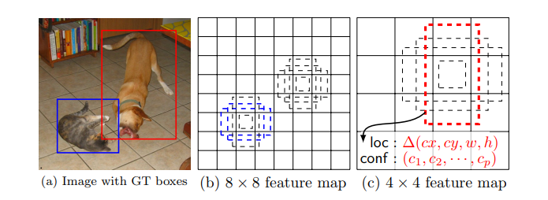
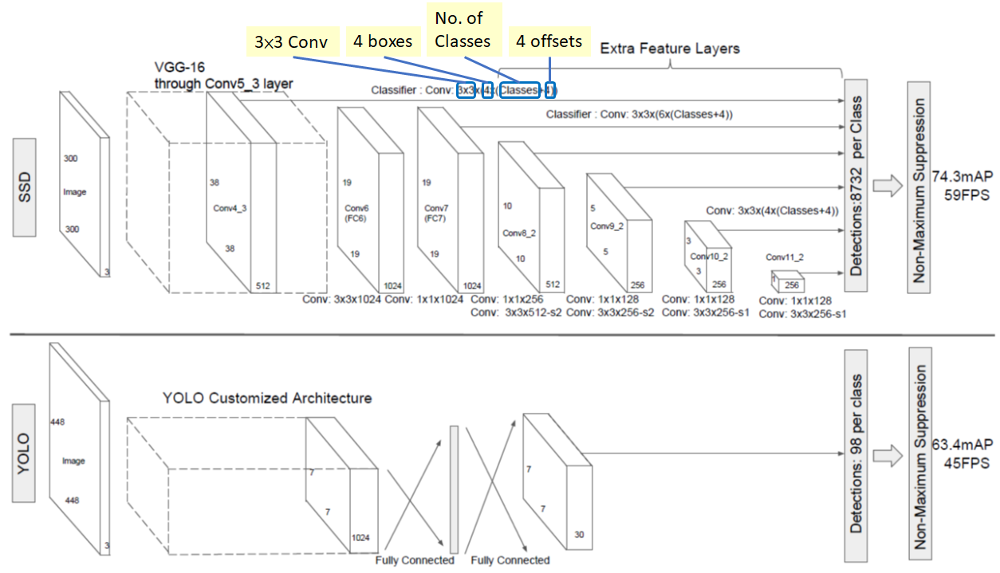

# 🤳 SSD ve YOLO

## 😉 You Only Look Once
- 💥 End to end yaklaşımıyla eğitilmiş tek bir sinir ağı içerir
  - Bir görüntüyü girdi olarak alır ve _bounding boxes_ ve her _box_ için sınıf etiketlerini (label) direkt tahmin eder
- 😕 Bu teknik daha düşük tahmin doğruluğu sunar (örneğin, daha fazla yerelleştirme (localization) hatası) _Bölge tabanlı modellere göre_
- ➗ YOLO giriş görüntüsünü bir S × S _grid_'e böler. Her hücre yalnızca bir objeyi tahmin eder

> 👷‍♀️ Uzun lafın kısası: Sistem giriş görüntüsünü S × S _grid_'e böler. Bir objenin merkezi bir hücreye düşerse, bu hücre bu objeyi algılar.

### 🎀 Avantajlar
- 🚀 Hız
- 🤸‍♀️ Gerçek zamanlı _(real time)_ uygulamalar için uygundur

### 🙄 Dezavantajlar
- 😕 Küçük boyutlu nesnelerde düşük performans
  - Kesin olmayan obje konumları verebilir

> TODO: Compare versions of YOLO

## 🤸‍♀️ SSD
- 💥 Tek bir derin sinir ağını kullanarak görüntüdeki objeleri tahmin eder. 
- 🤓 Ağ, _feature map_'lara uygulanan küçük _convolutional_ filtreleri kullanarak her bir obje kategorisinin varlığı için puanlar oluşturur.
- ✌ Bu yaklaşım, belirli objelerin varlığı için **bounding boxes** ve **scores** üreten bir _feed-forward CNN_ kullanır.
- ❗ Bu modelde, her _feature map_ hücresi bir dizi varsayılan _bounding boxe_'a bağlanır

### 👩‍🏫 Detaylar
- Feature extraction için belirli bir convolution'dan geçtikten sonra, mxn boyutunda bir **feature layer** elde ediyoruz (Konumların sayısı) ve p kanala sahip , aşağıdaki 8×8 ve 4×4 gib 
  - Ve bu m×n×p özellik katmanına 3 × 3 convolution uygulanır
- Her konum için, k tane bounding boxes elde ediyoruz. Bu kutular farklı boyutlara ve en boy oranlarına sahiptir. 
  - Olay, belki dikey bir dikdörtgen insan sığdırabilirken yatay bir dikdörtgen araba için sığdırabilir.
- Kutuların her biri için, orijinal varsayılan kutu şekline göre c sınıfı skorları ve 4 ofsetleri hesaplayacağız.

### 🤓 Uzun Lafın Kısası 
SSD obje algılama algoritması 2 bölümden oluşur:
- _Feature map_'leri çıkarma
- convolution filtrelerini tespit edilen objelere uygulama.

### 🕵️‍♀️ Değerlendirme
- YOLO'ya göre daha iyi doğruluk 
- Bölge tabanlı algoritmalara göre daha iyi hız

### 👀 Görselleştirme

## 🚫 SSD vs YOLO

## 🌞 Yazının Aslı
- [Burada 🐾](https://dl.asmaamir.com/8-objectdetection/2-ssdandyolo)

## 🧐 Referanslar
- [A 2019 Guide to Object Detection](https://heartbeat.fritz.ai/a-2019-guide-to-object-detection-9509987954c3)
- [Review: SSD — Single Shot Detector (Object Detection) ✨](https://towardsdatascience.com/review-ssd-single-shot-detector-object-detection-851a94607d11)
- [More on YOLO](https://medium.com/@jonathan_hui/real-time-object-detection-with-yolo-yolov2-28b1b93e2088)