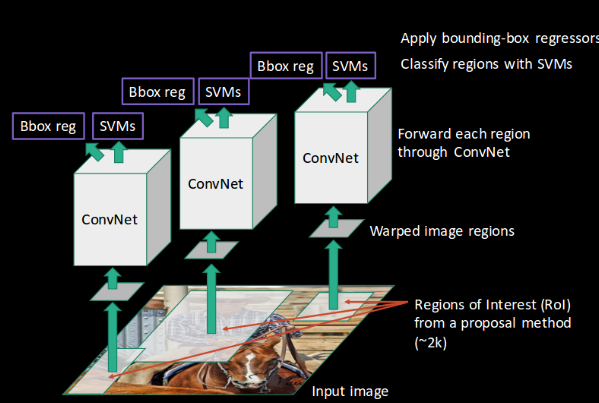
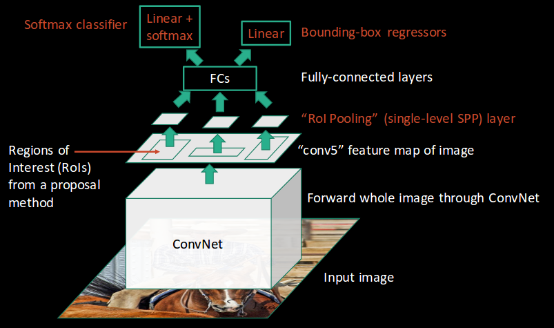
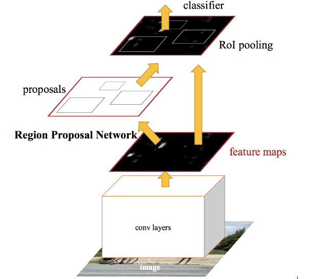
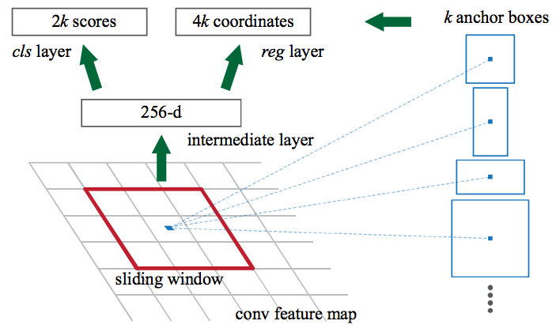
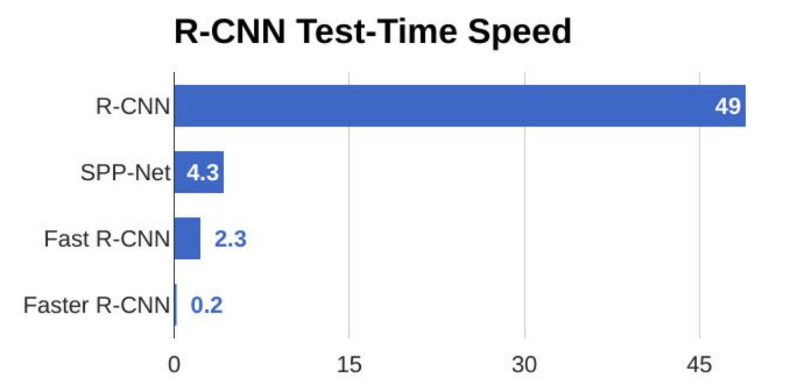

# ⭕ Bölge Tabanlı \(Region-Based\) CNN'ler

## 🔷 R-CNN _\(Region Based Convoltional Neural Network\)_

Aşağıdaki temellere dayanır: 1. Çok sayıda bölge seçmek 2. Ve sonra bunları _selective search_ yaparak 2000’e düşürmek

* Her bölgeye 'bölge adayı' _region proposal_ denir
  1. Her bölgeden convolutional özellikleri çıkarmak
  2. Sonunda herhangi bir obje bulunup bulunmadığını kontrol etme

### 🤔 _Selective Search_ nedir?

Farklı bölgeleri tanımlamak için bir algoritma, Temelde bir objeyi oluşturan dört bölge vardır: varying scales, colors, textures, and enclosure. Selective search Seçici arama, görüntüdeki bu kalıpları tanımlar ve buna göre **çeşitli bölgeler önerir**

> 🙄 Başka bir deyişle: Benzer ölgelerin hiyerarşik gruplamasını sağlamaya ve ona göre farklı bölgeler önermeye dayanan bir algoritmadır

### 👀 Görselleştirme

### 🙄 Dezavantajlar

* Eğitilmesi çok uzun sürer.
* Gerçek zamanlı -real time- uygulamaları için kullanılmaz.
* Selective search algoritması fix bir algoritmadır. O yüzden, o aşamada öğrenme gerçekleşmiyor.
  * Bu, kötü bölge adayı oluşturulmasına neden olabilir.

### 🤔 Neden çok yavaş?

R-CNN'ler çok yavaştır 🐢 sebepler:

* Selective search'e dayalı olarak her bir görüntü için 2.000 bölge çıkarmak
* Her görüntü bölgesi için CNN kullanarak özellikleri çıkarmak. 
  * Eğer N resmimiz varsa, CNN özelliklerinin sayısı N\*2000 olacaktır. 😢

## 💫 Fast R-CNN _\(Fast Region Based Convoltional Neural Networks\)_

Görüntü başına 2.000 kez CNN çalıştırmak yerine, görüntü başına yalnızca bir kez çalıştırabilir ve ilgi alanlarını \(Region Of Interest _ROI_\) elde edebiliriz \(bazı objeler içeren bölgeler\).

Yani, aşağıdaki mantığa dayanır: 1. **Tüm** görüntüyü CNN'ye besliyoruz 2. CNN bir _feature map_ oluşturur 3. Oluşturulan _feature map_'i kullanarak ROI'i çıkardık \(Region of interests\)

* 2000 bölgenin sorunu çözüldü 🎉
* Selective search'i hala kullanıyoruz 🙄
  1. Sonra, bölgeleri sabit bir boyuta yeniden boyutlandırıyoruz \(ROI pooling katmanını kullanarak\)
  2. Son olarak, bölgeleri fully connected katmana besleriz \(sınıflandırılmak üzere\)

### 👀 Görselleştirme

### 🙄 Dezavanatjlar

Bölge adayları Fast R-CNN algoritmasında hala darboğazlar oluşturuyor ve performansı etkiliyor.

## ➰ Faster R-CNN _\(Fast Region Based Convoltional Neural Networks\)_

Faster R-CNN, Selective search sorununu Region Proposal Network \(RPN\) ile değiştirerek giderir 🤗

Yani, aşağıdaki mantığa dayanır: 1. **Tüm** görüntüyü CNN'ye besliyoruz 2. CNN bir _feature map_ oluşturur 3. _Feature map_ üzerine RPN uygularız 4. RPN, nesne adaylarını, aday puanları _objectness_ ile birlikte döndürür.

* Selective search sorunu giderildi 🎉
  1. Sonra, bölgeleri sabit bir boyuta yeniden boyutlandırıyoruz \(ROI pooling katmanını kullanarak\)
  2. Son olarak, bölgeleri fully connected katmana besleriz \(sınıflandırılmak üzere\)

### 👀 Görselleştirme

### 👩‍🏫 RPN Nasıl Çalışır?

1. RPN, CNN'den _feature map_ alır
2. _Map_ üzerine 3\*3'lük pencere kullanır
3. _k_ tane anchor boxes üretir
   * Kutular farklı şekil ve boyutlardadır

_Anchor boxes_, görüntü boyunca yerleştirilmiş ve farklı şekil ve boyutlarda sabit boyutta kutularıdır. Her _anchor box_ için, RPN iki şeyi tahmin eder:

1. _Anchor_'un bir nesne olma olasılığını
   * \(objenin hangi sınıfa ait olduğunu dikkate almaz\)
2. _Anchor_'ları objeyi daha iyi sığdıracak şekilde ayarlamak için bounding box

#### 👀 Görselleştirme

## 😵 Kavramları Bir Araya Getirmek İçin

| Algoritma | Özet | Sınırlandırma |
| :--- | :--- | :--- |
| 🔷 R-CNN | Görüntülerden _selective search_ kullanarak 2000 bölge çıkartır | Yüksek hesaplama süresi |
| 💫 Fast R-CNN | Görüntü _feature maps_ çıkarmak için bir kez CNN'e geçirilir ve sonra bölgeler _selective search_ ile çıkarılır | Selective search yavaştır |
| ➰ Faster R-CNN | _Selective search_ yöntemini RPN ile değiştirir | yavaş \(?\) |

## ⚖ Benchmarks

## 🌞 Yazının Aslı

* [Burada 🐾](https://dl.asmaamir.com/8-objectdetection/0-regionbasedalgorithms)

## 🔎 Daha Fazla Oku

* [A Step-by-Step Introduction to the Basic Object Detection Algorithms](https://www.analyticsvidhya.com/blog/2018/10/a-step-by-step-introduction-to-the-basic-object-detection-algorithms-part-1/)
* [Deep Learning for Object Detection: A Comprehensive Review](https://towardsdatascience.com/deep-learning-for-object-detection-a-comprehensive-review-73930816d8d9)

