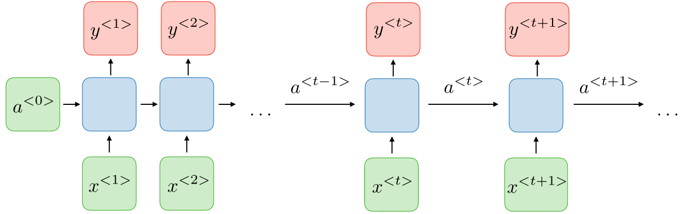
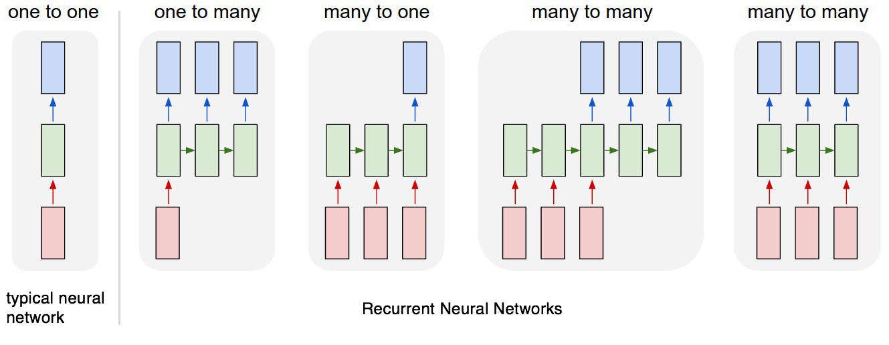
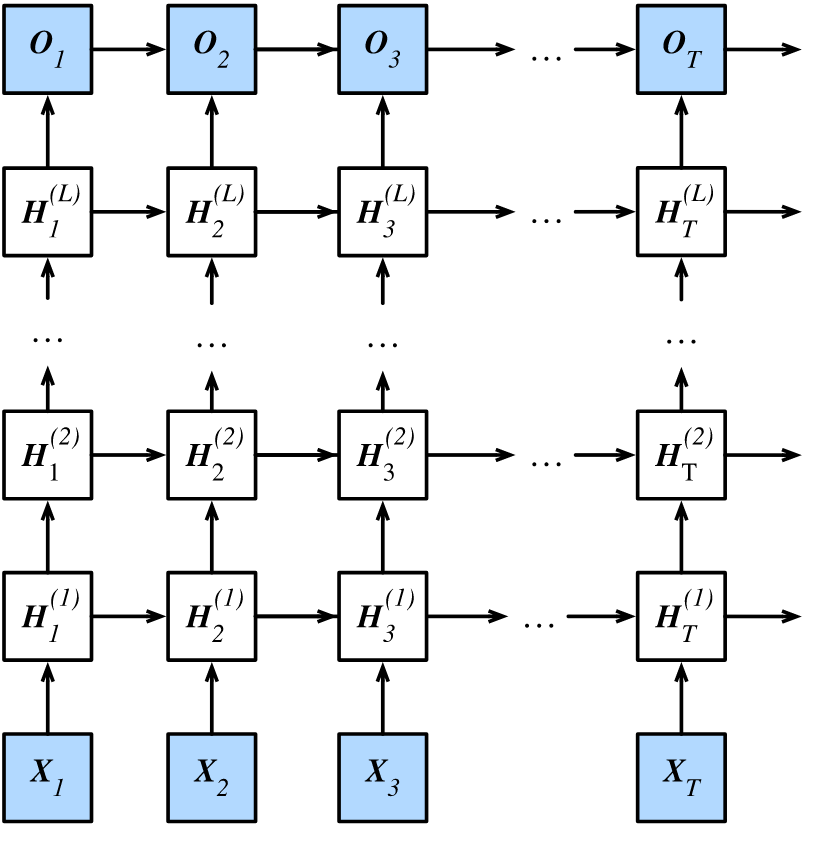

# 🔄 Tekrarlayan Sinir Ağları (RNN)

## 🔎 Tanım
Önceki çıkışların sonraki katmanlara giriş olarak kullanılmasına izin veren bir sinir ağı sınıfıdır
> Eğitim sırasında öğrendikleri şeyleri hatırlarlar ✨

## 🧱 Mimari

### 🔶 RNN Tamamının Mimarisi

### 🧩 Bir RNN Hücresi

Temel bir RNN hücresi. $$x^{⟨t⟩}$$'yi (Şimdiki girdi) ve $$a^{⟨t−1⟩}$$'yi (geçmişten gelen bilgileri içeren önceki gizli durum) girdi olarak alır, bir sonraki RNN hücresine verilen ve aynı zamanda $$y^{⟨t⟩}$$'yi tahmin etmek için kullanılan $$a^{⟨t⟩}$$'yi çıktı olarak verir 

## ⏩ Forward Propagation
**$$a^{<t>}$$'yi hesaplamak için:**

$$a^{<t>}=g(W_{aa}a^{<t-1>}+W_{ax}x^{<t>}+b_a)$$

**$$\hat{y}^{<t>}$$'yi hesaplamak için:**

$$\hat{y}^{<t>} = g(W_{ya}a^{<t>}+b_y)$$

### 👀 Görselleştirme

## ⏪ Back Propagation
**Kayıp fonksiyonu aşağıdaki şekilde tanımlanır**

$$L^{<t>}(\hat{y}^{<t>}, y^{<t>})=-y^{<t>}log(\hat{y})-(1-y^{<t>})log(1-\hat{y}^{<t>})$$

$$L(\hat{y},y)=\sum_{t=1}^{T_y}L^{<t>}(\hat{y}^{<t>}, y^{<t>})$$

## 🎨 RNN Türleri
- 1️⃣ ➡ 1️⃣ **One-to-One** (Klasik ANN)
- 1️⃣ ➡ 🔢 **One-to-Many** (Müzik Üretme)
- 🔢 ➡ 1️⃣ **Many-to-One** (Anlamsal Analiz)
- 🔢 ➡ 🔢 **Many-to-Many** $$T_x = T_y$$ (Konuşma tanıma)
- 🔢 ➡ 🔢 **Many-to-Many** $$T_x \neq T_y$$ (Makine Çevirisi)

# 🔥 Gelişmiş Tekrarlayan Sinir Ağları

## 🔄 Çift Yönlü Tekrarlayan Yapay Sinir Ağları (BRNN)
- Birçok uygulamada, tüm giriş sırasına bağlı olabilecek bir $$y^{(t)}$$ tahmini çıkarmak isteyebiliriz
- Bidirectional RNN'ler dizinin başlangıcından başlayarak zaman içinde **ileri** hareket eden bir RNN'i, dizinin sonundan başlayarak zaman boyunca **geri** hareket eden bir RNN ile birleştirirler.

### 💬 Başka Bir Deyişle
- Çift Yönlü Tekrarlayan Yapay Sinir Ağları aslında iki bağımsız RNN bir araya getiriyorlar. 
- Giriş dizisi bir ağ için normal zaman sırasıyla, diğeri için ters zaman sırasıyla aktarılır. 
- İki ağın çıkışları genellikle her zaman adımında birleştirilir.
- 🎉 Bu yapı, ağların, her adımda dizi hakkında hem geri hem de ileri bilgiye sahip olmalarını sağlar. 

### 👎 Dezavantaj
Tahmin yapmadan önce tüm veri dizisine ihtiyacımız vardır.

>e.g: gerçek zamanlı konuşma tanıma için uygun değildir 

### 👀 Görselleştirme

## 🕸 Derin RNN'ler
Çoğu RNN hesaplamaları, üç parametre bloğuna ve ilişkili dönüşümlere ayrıştırılabilir.:
1. Girişten gizli duruma, $$x^{(t)}$$ ➡ $$a^{(t)}$$
2. Önceki gizli durumdan sonraki gizli duruma, $$a^{(t-1)}$$ ➡ $$a^{(t)}$$
3. Gizli durumdan çıktıya, $$a^{(t)}$$ ➡ $$y^{(t)}$$

Derin tekrarlayan ağlarla sonuçlanan yukarıdaki dönüşümlerin her biri için birden çok katman kullanabiliriz 😋

### 👀 Görselleştirme

## ❌ Problem: Vanishing Gradients with RNNs
- 10.000 zaman adımı büyüklüğünde bir dizi verisini işleyen bir RNN, optimize edilmesi çok zor olan 10.000 derin katmana sahiptir 🙄
- Derin Sinir Ağlarında da, daha derin ağlar _vanishing gradient_ problem sorununa giriyor 🥽 
- Bu da, uzun dizi boyutuna sahip RNN'lerde de olur 🐛

### 🧙‍♀️ Çözümler
- RNN'deki Vanishing Gradients problemi üzerine [Yazımı](./2-VanishingGradients.md) okuyabilirsin  🤸‍♀️

## 🌞 Yazının Aslı
- [Burada 🐾](https://dl.asmaamir.com/9-sequencemodels/1-rnns)

## 🧐 Daha Fazla Oku
- [Recurrent Neural Networks Cheatsheet ✨](https://stanford.edu/~shervine/teaching/cs-230/cheatsheet-recurrent-neural-networks#)
- [All About RNNs 🚀](https://medium.com/@jianqiangma/all-about-recurrent-neural-networks-9e5ae2936f6e)