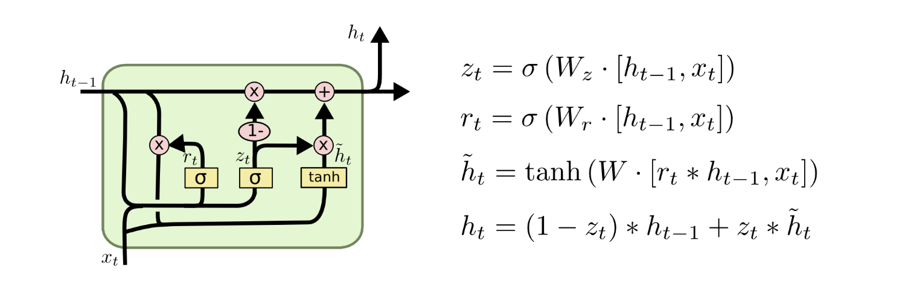

# 🌌 RNN'deki Vanishing Gradients
- 10.000 zaman adımı büyüklüğünde bir dizi verisini işleyen bir RNN, optimize edilmesi çok zor olan 10.000 derin katmana sahiptir 🙄
- Derin Sinir Ağlarında da, daha derin ağlar _vanishing gradient_ problem sorununa giriyor 🥽 
- Bu da, uzun dizi boyutuna sahip RNN'lerde de olur 🐛

## 🧙‍♀️ Çözümler
- **GRU** _Gated Recurrent Unit_ 
- **LSTM** _Long Short-Term Memory_ 

## 🚪 Gated Recurrent Unit (GRU)
GRU'lar standart tekrarlayan sinir ağlarının gelişmiş versiyonlarıdır ✨, GRU _güncelleme kapısı ve sıfırlama kapısını_ kullanır 
- Temel olarak, bunlar çıktıya hangi bilgilerin aktarılması gerektiğine karar veren iki vektördür
- Onlarla ilgili özel olan şey, bilgiyi uzun zaman önce tutmak için eğitilebilecekleridir
  - Zamanla kaybolmadan veya tahminle ilgili bilgileri çıkarmadan
  
| Kapı                 | Açıklama                                    |
| -------------------- |---------------------------------------------|
| 🔁 Güncelleme Kapısı | Modele, geçmiş bilgilerin ne kadarının (önceki zaman adımlarından) geleceğe aktarılması gerektiğini belirlemede yardımcı olur |
| 0️⃣ Sıfırlama Kapısı  | Modele, geçmiş bilgilerin ne kadarının **unutacağına** karar vermede yardımcı olur |

### 🔁 Güncelleme Kapısı
Bu kapı göz önüne alındığında, _vanishing gradient_ problemi ortadan kalkar çünkü model kendi başına geçmiş bilgilerin ne kadarını geleceğe taşıdığını öğreniyor.
> Kısaca: Şimdi ne kadar geçmiş önemli olmalı? 🙄

### 0️⃣ Sıfırlama Kapısı
Geçmiş bilgilerinin ne kadarının unutulacağına karar vermek için model tarafından kullanıldığından, bu kapı güncelleme kapısıyla karşılaştırıldığında tam tersi bir işlevselliğe sahiptir.
> Kısaca: Önceki bilgi düşürülecek mi? 🙄

### 💬 Current Memory Content
Geçmişten ilgili bilgileri saklamak için sıfırlama kapısını kullanacak bellek içeriği.

### 🎈 Final Memory at Current Time Step
Mevcut birim için bilgi tutan ve onu daha sonra ağa iletecek bir vektör.

### 👀 Görselleştirme

### 🎉 GRU Özeti
- **vanishing gradient** problemini gidermek için bir çözümdür 
- Model her seferinde yeni girişi kaybetmekte kalmıyor, ilgili bilgileri saklıyor ve ağın bir sonraki zaman adımlarına aktarıyor

## 🤸‍♀️ Long Short-Term Memory (LSTM)

### 0️⃣ Sıfırlama Kapısı (Forget Gate)
- Bir metinde kelimeler okuduğumuzu varsayalım ve örneğin tekil mi yoksa çoğul mu olduğu gibi gramer yapılarını takip etmek için bir LSTM kullanmak istiyoruz. 
- Eğer konu tekil bir kelimeden çoğul kelimeye geçerse, tekil / çoğul durumun önceden depolanmış hafıza değerinden kurtulmanın bir yolunu bulmalıyız. 
- LSTM'de, sıfırlama _(forget)_ kapısı bunu yapmamıza izin veriyor

$$\Gamma ^{<t>}_f = \sigma(W_f[a^{<t-1>}, x^{<t>}]+b_f)$$

- Burada,  $W_f$  sıfırlama kapısı davranışını yöneten ağırlıklardır. $$[a^{<t-1>} ve x^{<t>}]$$'yi birleştiriyoruz ve $$W_f$$ ile çarpıyoruz. Yukarıdaki denklem, 0 ile 1 arasında değerleri olan bir $$\Gamma_f^{<t>}$$ vektörüyle sonuçlanır 
- Bu sıfırlama kapısı vektörü, önceki hücre durumu $$c^{<t-1>}$$ olan ile element-wise çarpılır 
- Eğer $$\Gamma_f^{<t>}$$'nın değerlerinden biri 0 ise (veya 0'a yakınsa), LSTM'nin bu bilgi parçasını $$c^{<t-1>}$$'nin karşılık gelen bileşeninden çıkarması gerektiği anlamına gelir (örneğin: tekil nesne).
- Değerlerden biri 1 ise, bilgiyi olduğu gibi korunacaktır.

### 🔄 Güncelleme Kapısı (Update Gate)
Odaklandığımız nesnenin tekil olduğunu unuttuğumuzda, yeni nesnenin artık çoğul olduğunu yansıtacak şekilde güncellemenin bir yolunu bulmalıyız. Güncelleme kapısının formülü aşağıdaki gibidir:

$$\Gamma ^{<t>}_u = \sigma(W_u[a^{<t-1>}, x^{<t>}]+b_u)$$

Sıfırlama kapısında olduğuna benzer şekilde, burada $$\ Gamma_u^{<t>}$$ yine 0 ile 1 arasındaki değerlerden oluşan bir vektördür. Bu, $$c^{⟨t⟩}$$ 'i hesaplamak için, $$\tilde{c}^{<t>}$$ ile _element-wise_ çarpılacaktır.

### 👩‍🔧 Hücreyi Güncelleme
Yeni nesneyi güncellemek için önceki hücre durumumuza ekleyebileceğimiz yeni bir sayı vektörü oluşturmamız gerekiyor. Kullandığımız denklem aşağıdaki gibidir:

$$\tilde{c}^{<t>}=tanh(W_c[a^{<t-1>}, x^{<t>}]+b_c)$$

Son olarak, yeni hücre durumu:

$$c^{<t>}=\Gamma _f^{<t>}*c^{<t-1>} + \Gamma _u^{<t>}*\tilde{c}^{<t>}$$

### 🚪 Çıkış Kapısı (Output Gate)
Hangi çıktıları kullanacağımıza karar vermek için aşağıdaki iki formülü kullanıyoruz:

$$\Gamma _o^{<t>}=\sigma(W_o[a^{<t-1>}, x^{<t>}]+b_o)$$

$$a^{<t>} = \Gamma _o^{<t>}*tanh(c^{<t>})$$

Birinci denklemde, _sigmoid_ fonksiyonunu kullanarak neyin çıktısı alınacağına karar verirken, ikinci denklemde önceki durumu _tanh_ fonksiyonu ile çarpıyoruz.

> GRU, LSTM'den daha yeni, LSTM daha güçlü, ancak GRU'nun uygulanması daha kolay 🚧

## 🌞 Yazının Aslı
- [Burada 🐾](https://dl.asmaamir.com/9-sequencemodels/2-vanishinggradients)

## 🧐 Daha Fazla Oku
- [What are RNNs and GRUs](https://towardsdatascience.com/what-is-a-recurrent-nns-and-gated-recurrent-unit-grus-ea71d2a05a69)
- [Understanding GRU Networks](https://towardsdatascience.com/understanding-gru-networks-2ef37df6c9be)
- [Detailed LSTM](http://colah.github.io/posts/2015-08-Understanding-LSTMs/)