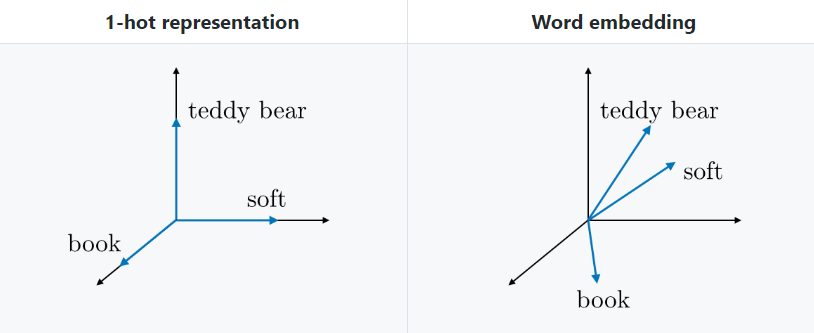

# 🌚 Kelime Gösterimi

> Bu dosya yanlış bilgi içerebilir 🙄‼ Lütfen bir hata bulduğunuzda düzeltmem için _Pull Request_ açın 🌟

* One Hot Encoding
* Featurized Representation \(Word Embedding\)
* Word2Vec
* Skip Gram Model
* GloVe \(Global Vectors for Word Representation\)

## 🚀 One Hot Encoding

Kelimeleri temsil etmenin bir yolu, böylece onları kolayca kullanabilriz

### 🔎 Örnek

Diyelim ki 10 kelimeden oluşan \(🤭\) bir sözlüğümüz var ve sözlüğkteki kelimeler:

* Car, Pen, Girl, Berry, Apple, Likes, The, And, Boy, Book.

Ve Bizim $$X^{(i)}$$: **The Girl Likes Apple And Berry**

Böylece bu diziyi aşağıdaki gibi temsil edebiliriz 👀

```text
Car   -0)  ⌈ 0 ⌉   ⌈ 0 ⌉   ⌈ 0 ⌉   ⌈ 0 ⌉  ⌈ 0 ⌉   ⌈ 0 ⌉ 
Pen   -1)  | 0 |  | 0 |  | 0 |  | 0 |  | 0 |  | 0 |
Girl  -2)  | 0 |  | 1 |  | 0 |  | 0 |  | 0 |  | 0 |
Berry -3)  | 0 |  | 0 |  | 0 |  | 0 |  | 0 |  | 1 |
Apple -4)  | 0 |  | 0 |  | 0 |  | 1 |  | 0 |  | 0 |
Likes -5)  | 0 |  | 0 |  | 1 |  | 0 |  | 0 |  | 0 |
The   -6)  | 1 |  | 0 |  | 0 |  | 0 |  | 0 |  | 0 |
And   -7)  | 0 |  | 0 |  | 0 |  | 0 |  | 1 |  | 0 |
Boy   -8)  | 0 |  | 0 |  | 0 |  | 0 |  | 0 |  | 0 |
Book  -9)  ⌊ 0 ⌋   ⌊ 0 ⌋   ⌊ 0 ⌋   ⌊ 0 ⌋  ⌊ 0 ⌋   ⌊ 0 ⌋
```

Dizileri bu şekilde temsil ederek verileri sinir ağlarına aktarabiliriz ✨

### 🙄 Dezavantaj

* Eğer sözlüğümüz 10.000 kelimeden oluşuyorsa, her vektör 10.000 boyutlu olacaktır 🤕 
* Bu gösterim anlamsal özellikleri yakalayamaz 💔

## 🎎 Featurized Representation \(Word Embedding\)

* Kelimeleri cinsiyet, yaş, kraliyet, yemek, maliyet, büyüklük vb. gibi özelliklerle ilişkilendirerek temsil etmek
* Her özellik \[-1, 1\] arasında bir aralık olarak temsil edilir 
* Böylece her kelime bu özelliklerin bir vektörü olarak gösterilebilir
  * Her vektörün boyutu, seçtiğimiz özelliklerin sayısına bağlıdır

### 🔢 Embedded Matrix

For a given word _w_, the embedding matrix _E_ is a matrix that maps its 1-hot representation $$o_w$$ to its embedding $$e_w$$ as follows: $$e_w=Eo_w$$

> Çeviremedim 😢

### 🎀 Avantajlar

* **Benzer** anlama sahip olan kelimelerin **benzer** bir gösterimi vardır.
* Bu model anlamsal \(semantic\) özellikleri yakalayabilir ✨ 
* Vektörler one-hot gösterimindeki vektörlerden daha küçüktür.

> TODO: Subtracting vectors of oppsite words

## 🔄 Word2Vec

* Word2vec, Verilen bir kelimenin diğer kelimelerle çevrili olma olasılığını tahmin ederek kelime embedding'lerini öğrenme stratejisidir.
* Bu, daha sonra aldığımız **pencere boyutu**na bağlı olan bağlam \(context\) ve hedef \(target\) kelime çiftleri yaparak yapılır.
  * **Pencere boyutu**: Bağlam sözcüğünün soluna ve sağına bakan bir parametredir


> _pencere boyutu = 2_ ile _bağlam-hedef_ çiftleri oluşturma 🙌

## Skip Gram Model

Skip-gram word2vec modeli verilen herhangi bir _t_ hedef kelimesinin _c_ gibi bir bağlam kelimesi ile gerçekleşme olasılığını değerlendirerek kelime embedding'lerini öğrenen denetimli bir öğrenme görevidir. _P\(t\|c\)_ olasılığı da aşağıdaki şekilde hesaplanır:

$$P(t|c)=\frac{exp(\theta^T_te_c)}{\sum_{j=1}^{|V|}exp(\theta^T_je_c)}$$

> Not: Softmax bölümünün paydasındaki tüm kelime sözlüğünü toplamak, bu modeli hesaplama açısından maliyetli kılar

### 🚀 One Hot Rep. vs Word Embedding



## 🧤 GloVe

Kelime gösterimi için Global vektörler tanımının kısaltılmış hali olan GloVe, eşzamanlı bir _X_ matrisi kullanan ki burada her bir $$X_{ij}$$, bir hedefin bir _j_ bağlamında gerçekleştiği sayısını belirten bir kelime gömme tekniğidir. Maliyet fonksiyonu _J_ aşağıdaki gibidir:

$$J(\theta)=\frac{1}{2}\sum_{i,j=1}^{|V|}f(X_{ij})(\theta^T_ie_j+b_i+b'_j-log(X_{ij}))^2$$

_f_, $$X_{ij}=0$$ ⟹ $$f(X_{ij})$$ = 0 olacak şekilde bir ağırlıklandırma fonksiyonudur.

Bu modelde _e_ ve _θ_'nın oynadığı simetri göz önüne alındığında, $$e^{(final)}_w$$'nin kelime embedding'i şöyle ifade edilir:

$$e^{(final)}_w=\frac{e_w+\theta_w}{2}$$

## 👩‍🏫 Word Embeddings'in Özeti

* Eğer bu ilk denemen ise, yapılmış ve gerçekten en iyi şekilde çalışan önceden eğitilmiş bir modeli indirmeyi denemelisin.
* Yeterli veriye sahipsen, mevcut algoritmalardan birini uygulamaya çalışabilirsin.
* Kelime embedding'lerinin eğitilmesi çok maliyetli bir işlem olduğu için, çoğu ML'ciler önceden eğitilmiş embedding'ler kullanırlar.

## 🌞 Yazının Aslı

* [Burada 🐾](https://dl.asmaamir.com/9-sequencemodels/3-wordrepres)

## 🧐 Referanslar

* [Recurrent Neural Networks Cheatsheet ✨](https://stanford.edu/~shervine/teaching/cs-230/cheatsheet-recurrent-neural-networks)
* [NLP — Word Embedding & GloVe](https://medium.com/@jonathan_hui/nlp-word-embedding-glove-5e7f523999f6)

