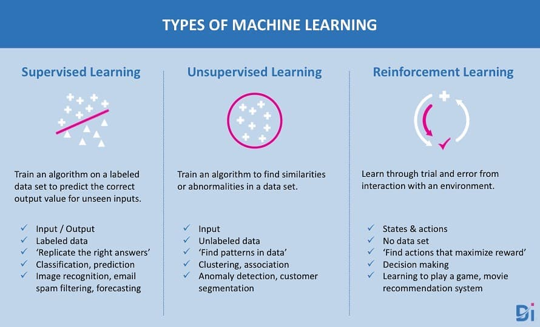
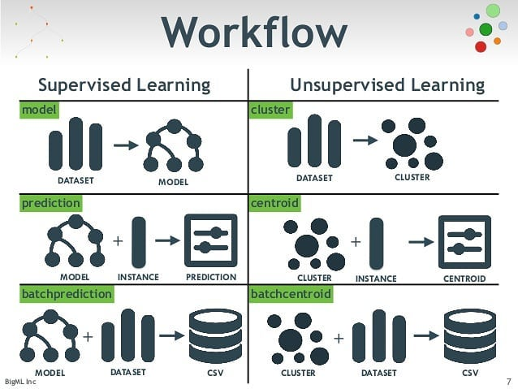
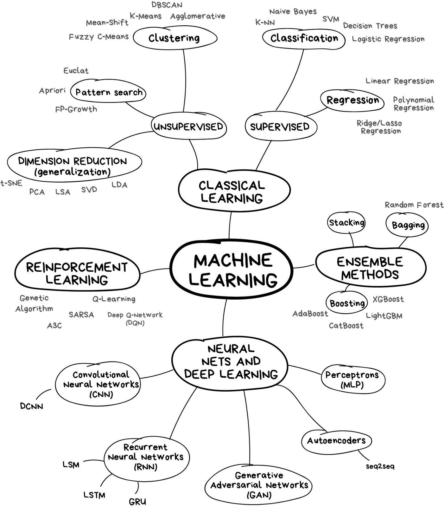

# 👀 Hızlı Görsel Bilgiler

> Materyaller arttıkça farklı dosyalara (veya kategorilere) ayrılacaktır 👮‍

## 📚 Makine Öğrenmesi Türleri

### 👓 Gözetimli Öğrenme vs Gözetimsiz Öğrenme

### 🕶 Makine Öğrenmesi vs Derin Öğrenme

### 🧠 Makine Öğrenmesi Akıl Haritası

## 🐾 Takip Edilmesi Gereken Kaliteli Kaynaklar
* [Instagram AI Machine Learning](https://www.instagram.com/ai_machine_learning/)

## 🌞 Yazının Aslı
- [Burada 🐾](https://dl.asmaamir.com/z-quickvisualinfo)